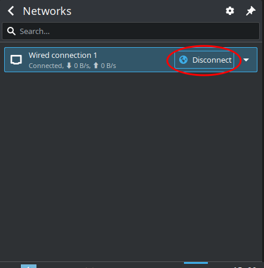

## 摘要

 
若在linux下手滑点到休眠键，**不要手动关机，等机器自己关**。  
没配置休眠的结果最多是正在进行的任务丢失，但此时手动关机可能导致系统损坏。


archlinux没有设置休眠，但手滑点到了休眠键，于是长按电源键关机。**（危险操作，请勿模仿）**

再次开机后发现有线网络一直显示connecting但一直连不上。

执行`# systemctl status dhcpcd`发现unit dhcpcd.service not found。

使用安装了archlinux镜像的u盘arch-chroot挂载原来的根目录重新安装dhcpcd包，问题解决。

~~Fuck you kde, fuck you Nvidia~~:rage:

<!--more-->

## 配置

OS: Arch Linux x86_64
DE: Plasma 6.0.2 
CPU: Intel Xeon E5-1607 v3 (4) @ 3.100GHz 
GPU: NVIDIA NVS 315 
Memory: 6310MiB / 128745MiB
Boot Loader: grub

## 过程

工位上的电脑装了Windows和archlinux双系统，日常使用archlinux。工位电脑内存128GB（没错我说的就是内存）所以没设休眠，但KDE的application launcher上不知道为什么还是有个hibernate图标。（Fuck you KDE:rage:）

然后手滑误点该图标，又脑残长按了电源键，再次开机发现网络一直在转圈圈但就是连不上，但机房里别人的网络都好使，自己的windows也好使，且多次重启均未解决问题。

执行`# systemctl status dhcpcd`发现unit dhcpcd.service not found。

工位有个装了ventoy的u盘，我在上面下了个archlinux的.iso镜像，然后从u盘启动。

### 微码错误

在ventoy的界面上选择boot in normal mode后显示microcode未更新开不开机，选择boot in grub2 mode后微码错误解除。

### nomodeset

解除微码错误后还是开不开机，屏幕上出现"triggering uevents"后就会黑屏。查询了[这篇帖子](https://bbs.archlinux.org/viewtopic.php?id=151259)，[添加内核参数](https://wiki.archlinux.org/title/Kernel_parameters)`nomodeset nouveau.nomodeset=0`（我使用 grub，在grub界面出现时按e键，在linux一行的末尾添加参数）后成功开机。（Fuck U Nvidia :rage:）

### arch-chroot

开机后电脑将会运行u盘中的archlinux系统。

执行`# mount /dev/sda[some number] /mnt`，将原系统的根目录挂载到u盘系统的`/mnt`上。

`# arch-chroot /mnt`将u盘系统的根目录切换到原先的根目录，重新安装dhcpcd和networkmanager后关机。

### 后续处理

然后拔掉u盘开机，网络恢复正常。

尝试隐藏 KDE Application Launcher上的hibernate图标，但没找到方法（Fuck U KDE :rage:）。无奈之下只能`# systemctl mask hibernate.target`，mask之后倒确实不显示图标了。
