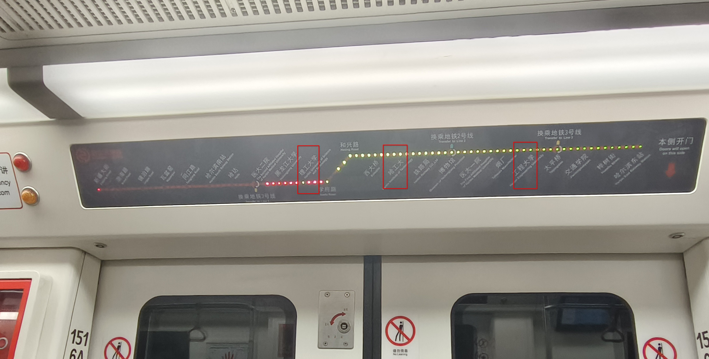
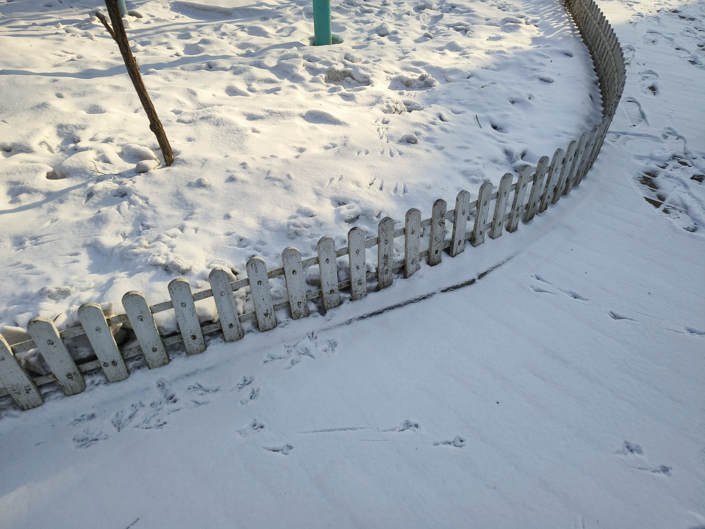
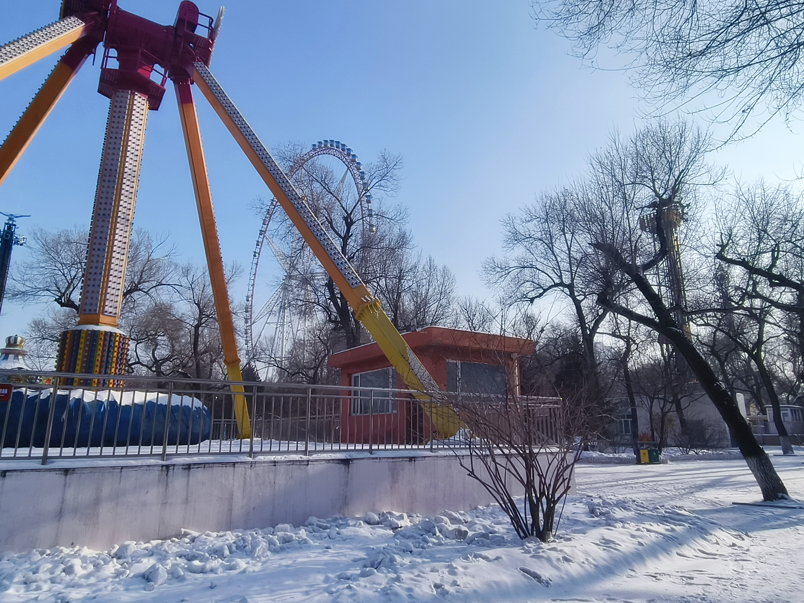
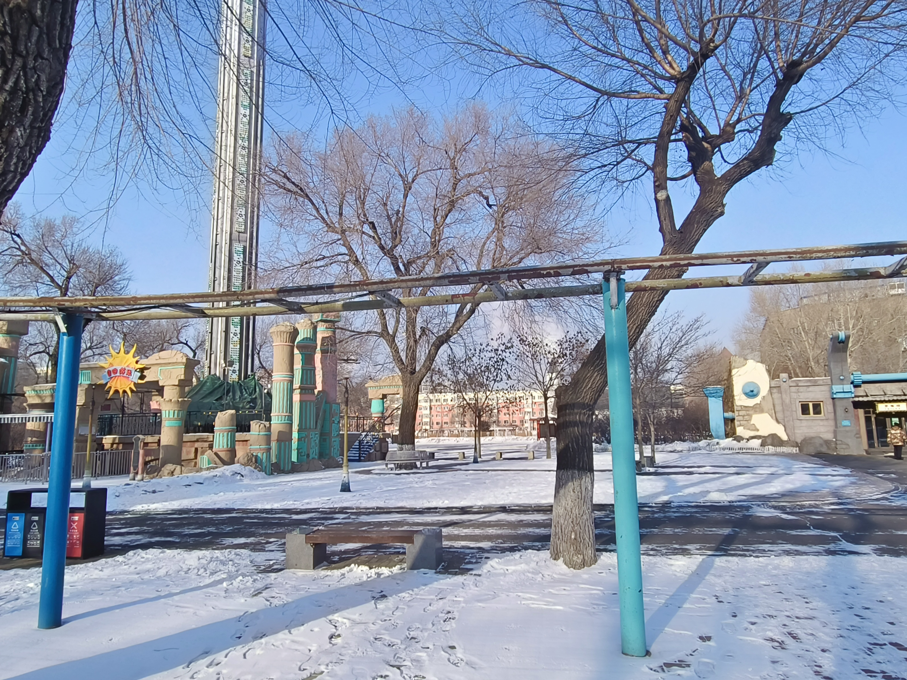
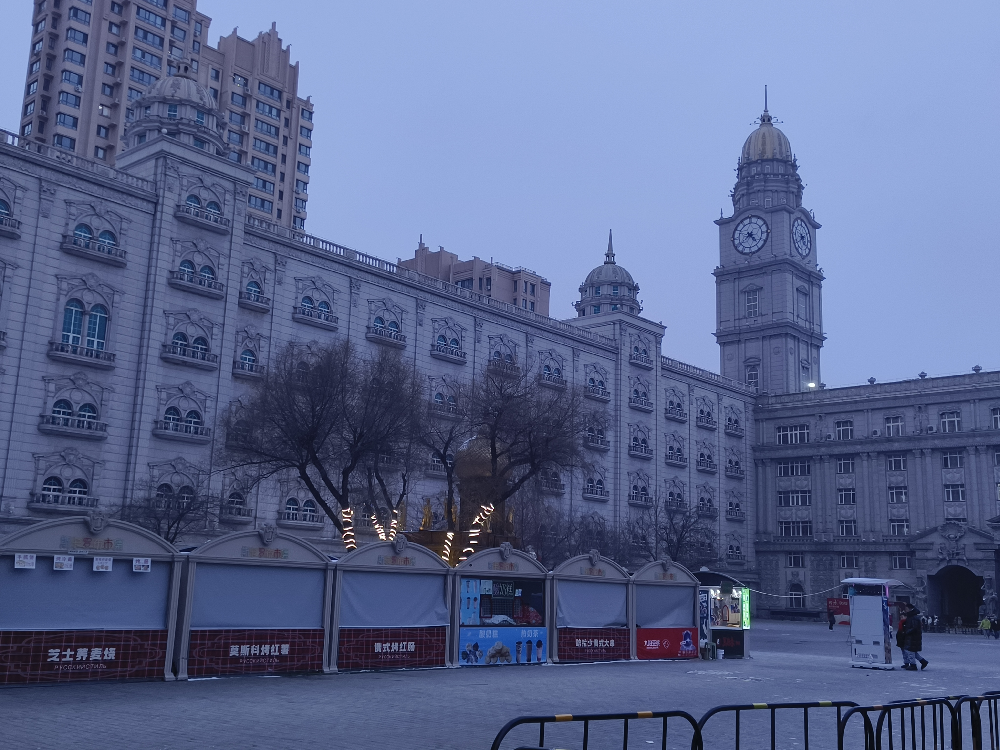
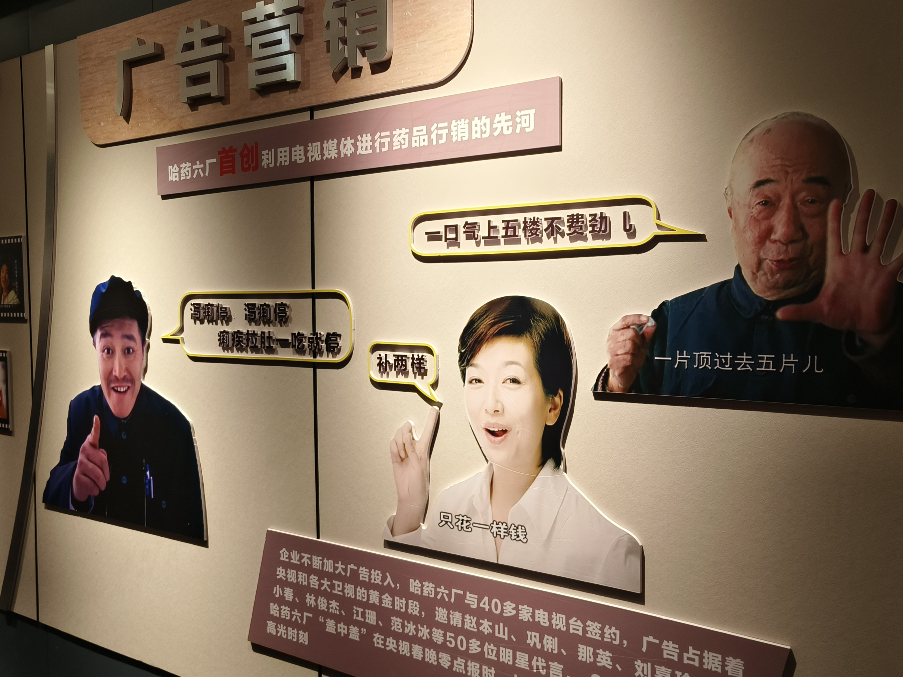
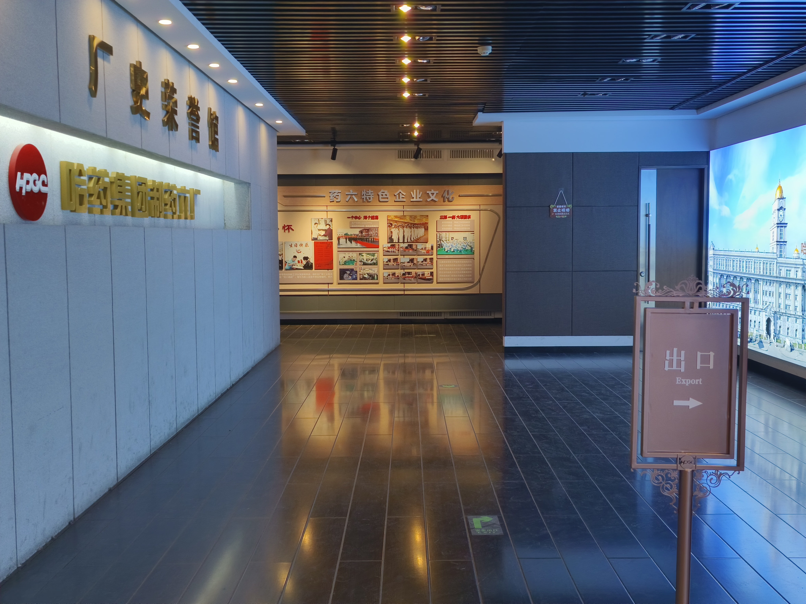

去年开始哈尔滨旅游热，寒假回家的机票很难买。我虽在哈尔滨居住了12年，但一直过着两点一线的生活，对哈尔滨这片土地的了解倒不一定有游客多。

从我上初中开始雾霾成了哈尔滨的大问题，一直到上大学才有所缓解。年前哈尔滨连日雾霾无法旅游，春节以后雾霾消散，年后亚冬会更不能有雾霾。

在哈尔滨生活过的人多不喜欢哈尔滨。出租车司机对游客的一贯话术是“有什么好来的”，对本地人的话术则是“润！”。南大校门口有个卖水果的，以前在哈尔滨远大开过几年店，也不喜欢哈尔滨。黄绿高中有一名老师说总有学生宁可去外地不如哈工大的学校也不去哈工大。

在知乎上看到帖子，说孟母三迁，不是因为下个地方有多好，而是现在的地方呆不下去了。

我在情感上也不喜欢哈尔滨。但这些不愉快的经历是不是由哈尔滨造成的，或者这些事在别的地方有没有，我就不知道了。

哈尔滨从我小学就开始修地铁，到我大四地铁才全部通车，两条直线一条环线。哈尔滨市区不大，有地铁之后到哪都不会太远。可惜家附近没有地铁站，虽然规划的4号线和5号线有家附近的站点，但通车至少5年之后了。

## 文化公园

极乐寺、普照寺、文化公园、以及哈工程在一起。

下图是哈工大（工业大学）、哈工程（工程大学）和哈理工（理工大学）的位置关系：

高二老师给我一个平安扣，说是极乐寺请的，用完要还回去。我戴着去考试，然后考试当天身体不舒服，寄了。

极乐寺有个专门卖这些东西的店，价格还算正常。

24年初我曾去过一次极乐寺，当时附近有很多算命的，见人就喊。今年去没碰见。

极乐寺门口有块牌子，上面写着“助人大于吃素，吃素大于放生，不合理的放生有损功德”。我爸有一阵热衷于把菜市场卖的鱼放进河里，本来想照下来给我爸看，又怕他去吃素，所以算了。

极乐寺有门票，旁边有个小一点尼姑庵叫普照寺，没有门票，有群众在里面念经，比起念经更像唱歌，还挺好听。

文化公园是东大直街1号。

我小学曾组织到文化公园春游，当时太小，又全是人，没玩到什么，只有“青蛙跳”尚可，实际上是小型跳楼机。春游期间小学班主任曾溜走自己去坐了一次大跳楼机。初一我又去过一次，没敢坐跳楼机，不过过山车很好玩。高中时政府要求市政公园不收门票，游乐设施关停，其中过山车被搬走。

那天摩天轮一边有几个人骑独轮车，另一边有老人对墙打网球。雪堆两边是爷孙打雪仗，几个小孩在雪堆上打滑梯。过山车搬走的空地上有人跑步。矮栅栏围着的草坪上落着雪，上面有鸟脚印。

 

 

## 哈药六厂

小时候电视上铺天盖地的哈药六厂的广告，也常吃哈药六厂的药。后来就不常听说了。现在厂子搬到江北了，原厂址变成了版画博物馆。

有人说哈药六厂像卢浮宫，但我没去过卢浮宫。

没有门票。里面有个厂史馆，我怎么看怎么像黑历史馆，最后出口牌子的英文还写错了。

厂史写哈药六厂2001年之前赚了一大笔钱，然后盖卢浮宫和职工小区，2004年竣工。但之后厂子再没赚到那么多钱。

厂子做过一大堆抽象广告，有一些现在看来有夸大作用之嫌。厂子还编造过一个捐款广告，但实际上没捐款，后被禁播。

   

几天后我坐公交车，看见车上座套上写着“正阳河工厂参观，免费接送”。我小时候家里经常买正阳河的调料，现在也不常见了。

## 萧红故居

坐地铁到哈尔滨北站，倒公交到呼兰。

纪念馆没什么特殊的，无非这人的生平。从小受新思想的教育，自身又有些才华，但又无法在乱世里自食其力，颠沛流离，早逝。

小地主家庭，两个院子，一个自己和长工住，一个租出去。

看《呼兰河传》时以为里面的故事是整个呼兰的，现在才知道一整本书的事全是在一个院子里发生的。

看了真的平房，才学会在mc里造房子。

故居里面停了很多小猫车。

 

## 历史建筑

哈尔滨不缺历史建筑。

博物馆附近有大量的外国领事馆。以前经常路过但没仔细看过。

道外江边有一片老建筑，修过的叫中华巴洛克，游客很多。前几年看到一个没修过的老房子，窗户里面贴着老式的美人广告画，颜色仍然鲜艳。今年去看时，那栋楼的正面被围上看不见了，从背面能看到房顶已经塌了。

