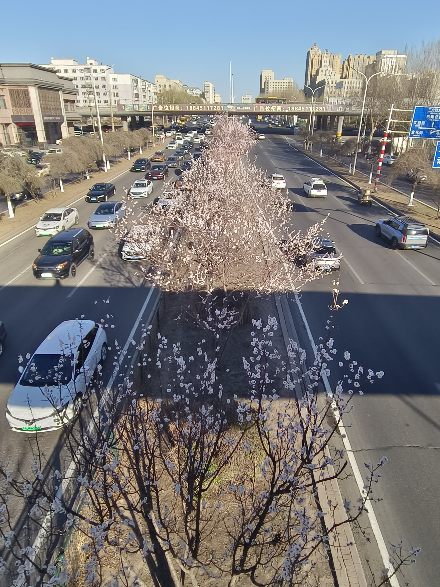
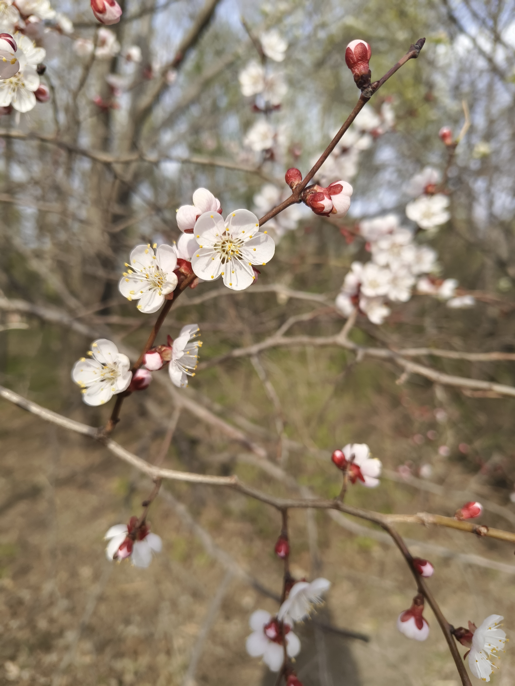
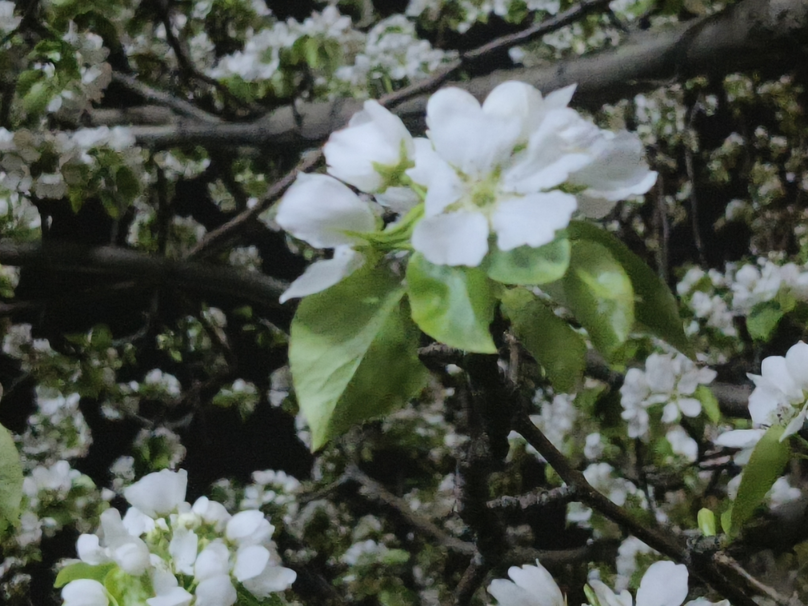
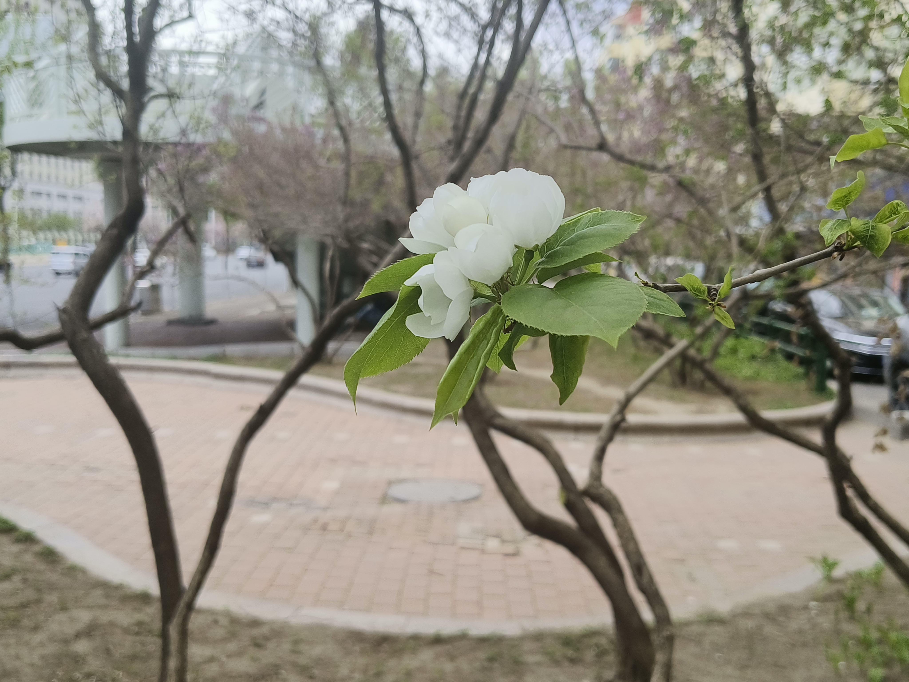
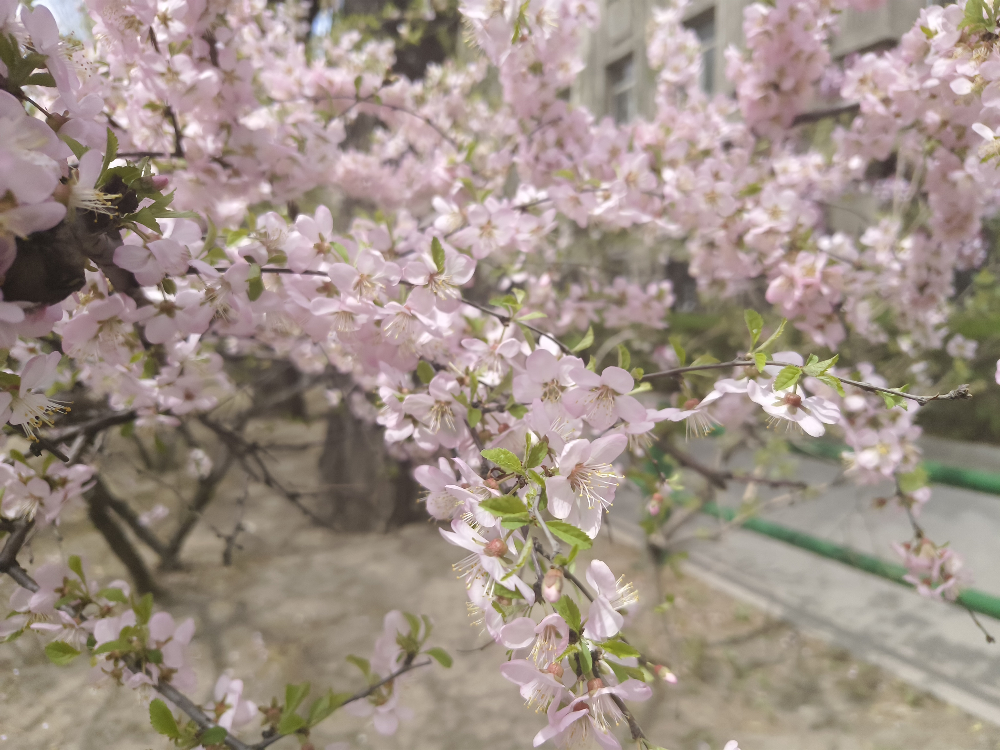
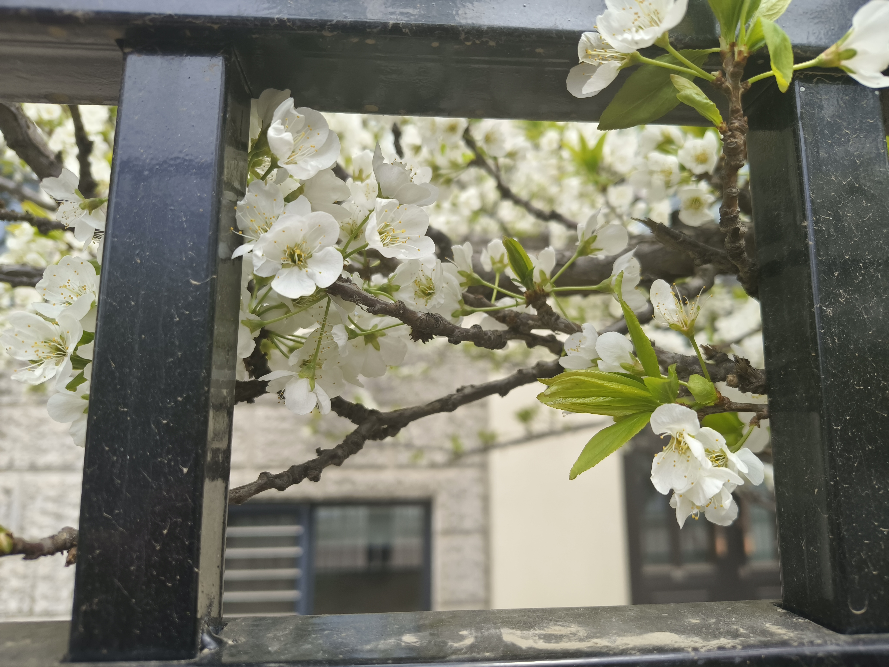
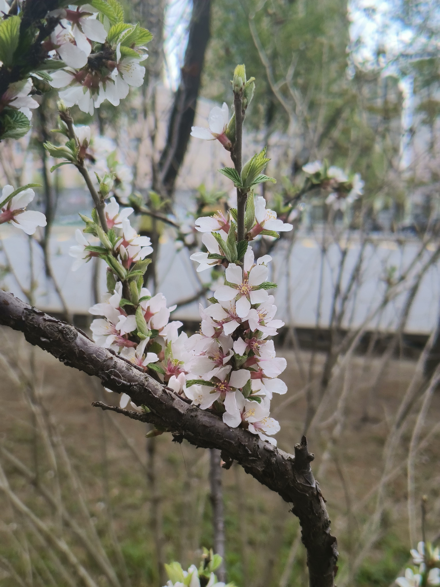
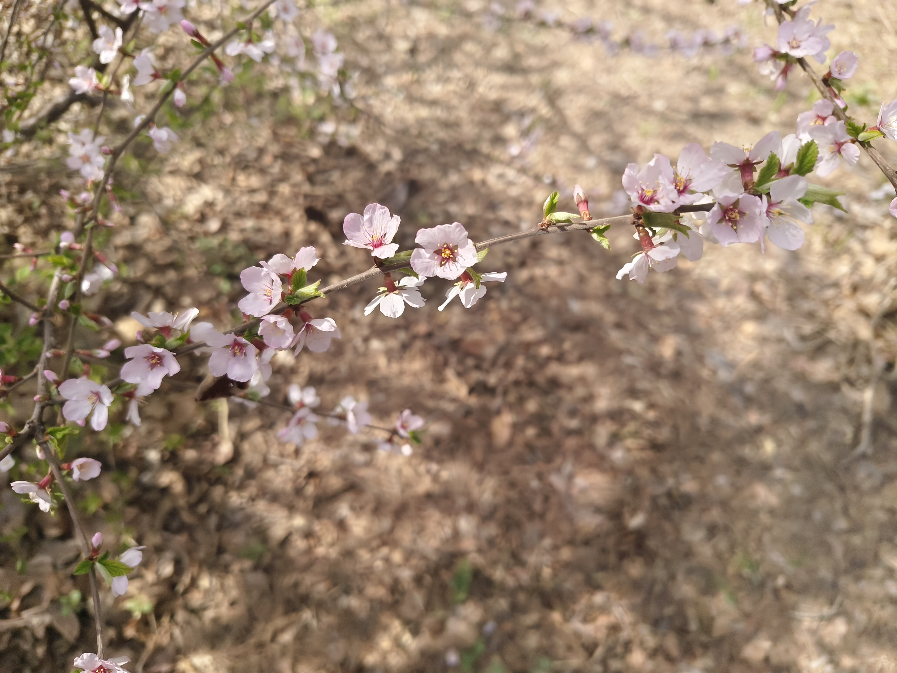

小时候看古诗词，不知道里面写的花到底长什么样。到南京上大学后，有意地去认识诗词里出现的花。

五一回哈，发现其实很多花哈尔滨也有，只是我在学校、家、补课班三点一线，没注意过绿化带里的植物。

## 杏花

哈尔滨的绿化带里种满了杏花，不乏大树，开得比南京的杏树更旺盛。

 

我高中院里有两棵树，一棵是杏树，另一棵也是杏树。这两棵树都很瘦，春天纸片一样的花稀疏地挂在枝头。8月结果，班主任让学生摘杏子给他吃。

植物园里有很多杏树，且里面的杏树也分不同的品种，有大花的，有小花的，还有花瓣正圆花萼正红，像梅花一样喜庆的。

  

 

## 梨花

- 紫红色花蕊
- 晶莹的白花
- 花瓣较长

我在南京没见过梨花，看见哈尔滨绿化带里的梨花，远看以为是海棠，近看以为是樱花。

名人名言：梨花的花瓣是月亮做的

  

## 榆叶梅

- 花与桃花相似
- 叶子比桃叶宽，叶子锯齿比桃叶大

哈尔滨大概没有桃花，榆叶梅算是桃花类似物，花相似，叶子区别较大。

和桃花相似，榆叶梅有单瓣的也有重瓣的，颜色也多种多样，从浅粉到深粉不等。但榆叶梅一朵花只有一个颜色，没有桃花“可爱深红爱浅红”的感觉。

 

下面的两张照片和桃花非常相似：

 

以及植物园里的其他种类（重瓣榆叶梅在绿化带中也很常见）

 

## 兴安杜鹃

传统民俗在春节前上山采兴安杜鹃插瓶作为年宵花，近年有人大量折枝在网上销售，政府大力宣传兴安杜鹃是保护植物禁止折枝。据说东北林业大学已研究出了兴安杜鹃的人工种植方式。

植物园有一个区域只种兴安杜鹃，我去的时候有个一身粉衣服的老人用葫芦丝吹映山红，两个穿紫裙子的老人伴舞。

 

注：伊春的兴安杜鹃也开了

## 李花（可能是？）

绿化带里，开得非常好

春色满园关不住系列：

 

## 毛樱桃

- 花梗短
- 花筒长
- 花心粉红色

有人说梨花的紫红色花蕊像美人哭红了眼睛，我觉得毛樱桃更像，为什么没有毛樱桃一枝春带雨

毛樱桃也有浅粉色花的

 