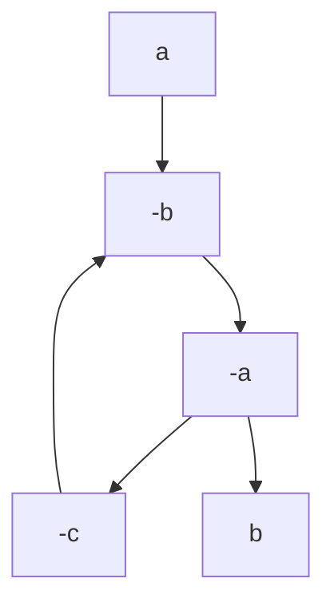
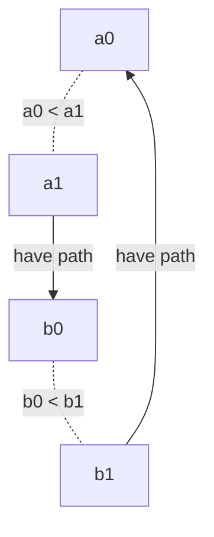

## 游寄

[补题链接](https://pintia.cn/market/item/1705511462254264320)，每天签到可得5金币，取消勾选“购买时光机”，仅购买考试券即可交题。

去实习的队友还没回来，还是2人场，高罚时6题，寄。

<!--more-->

开场，~~因题目名字看起来最水~~第一个点开M，发现可做，光速交题，过。

写完M看到E有人过了，略加思索发现bfs时暴力沿路径端点往上跳入队就行了，过。

我写E时队友在看D，发现结论是min{每行最小之和，每列最小之和}，~~由于没考虑负数和没开longlong等问题罚时++~~，后A

我看I，~~想了亿会后~~不会，队友说L过了不少人，我看了一眼，发现是KMP板子。写到一半队友发现I的答案一定是要么从1直接走到n，要么从1出发到某个点不停作死，死了就一步步走回来，然后A掉I。我接着写L，过。

现在场上只有C和K通过人数较多，看C，我感觉像网络流，但是建不出来图，数据范围也不对，就一直在往模拟费用流那面想。~~队友说C像2-sat，我说我不会2-sat，然后就没有进一步讨论。我真傻，真的~~。然后队友看K，说K可以exgcd乱搞，我作为小黄鸭推了一遍公式觉得没问题，队友写K，过。

然后看C看到自闭，最后A也过了不少人，但对A也没什么头猪。

结束后问大佬C怎么做，大佬说2-sat+二进制分组，我想了想发现不用二进制分组，可以直接前缀后缀连两串辅助点。~~刚做完的hdu多校原题，我真傻，真的~~

---

## C

### 题意

给定$n$个点$n-1$条边的链，每个点有点权`a[i]`，要求选中一些边，使得：

- 选中的边集覆盖所有点

- 若两条边的左端点点权与右端点点权都相等，那么这两条边不能一起选

判断是否有解，若有，输出任意一组。

### 做法

#### Update on 2023.10.09

终于能登上hdu了。

[此题的hdu多校加强版](https://acm.hdu.edu.cn/showproblem.php?pid=7308) （网络赛还贴心地弱化了题目，他真的，我哭死）

其实根据hdu原题的题解(orz Claris)，根本不需要建两行辅助点，在跑Kosaraju的时候对每个互斥集合用指针记录一下前面和后面都加到哪里了就行了。

#### 原贴

2-sat能做的事是给定$n$个`bool`变量和一些形如$(\neg) a_i \lor (\neg) a_j$的限制条件，求一组解或判定解不存在。

具体过程是将或限制转化为等价的蕴涵限制（逆否命题也要加入，否则会出bug）。如$a\lor b$转化为$\neg a \rightarrow b,\ \neg b \rightarrow a$ ，然后跑强连通分量，若存在变量 $a\ s.t.\ scc(a)=scc(\neg a)$ 则无解，否则若$scc(a)<scc(\neg a)$ 则 $a=false$ ，反之 $a=true$ 。$scc$上的 $<$ 定义为图上的偏序关系，即若 $scc_1\neq scc_2 \land \exists u \in scc_1 (\exists v \in scc_2 (u\dashrightarrow v))$ ，其中 $u\dashrightarrow v$ 意为u可达v，则$scc_1 < scc_2$

不加逆否命题的下场：（不加逆否命题跑出来无解一定无解，但跑出来有解实际不一定有解）



跑scc得出结果有解，$a=0,b=1$，但实际上$-b=-a=1\rightarrow b=0$，矛盾

若所有蕴含式的逆否命题都加入，则哪个在前面哪个是0的做法一定能得出一组正确的解，原因如下：

若$\forall a \in S_{bool},\ scc(a)\neq scc(\neg a)$但仍无解，则按上述方法赋值后，一定存在1连到0的边（否则得到合法解）。设$\exists a_0$为变量$a$赋值为$0$的点， $\exists b_1$为变量$b$赋值为$1$的点，存在$b_1\dashrightarrow a_0$的路径。由于所有蕴含式的逆否命题都已加入，则$\exists a_1\dashrightarrow b_0$的路径。



- 若存在$a_0\dashrightarrow a_1$的路径，则存在$b_1\dashrightarrow b_0$的路径$b_1\dashrightarrow a_0 \dashrightarrow a_1 \dashrightarrow b_0$，与$scc(b_0) < scc(b_1)$矛盾。

- 若存在$b_0\dashrightarrow b_1$的路径同理。

- 若两者都不存在，则$scc(a_0)<scc(a_1) \leq scc(b_0) < scc(b_1)$，与$scc(b_1)\leq scc(a_0)$矛盾。

对于一个集合最多选一个的限制，可以建两行辅助点，一行从前向后连，一行从后向前连，两行都连到集合的假点上，然后集合中每个变量的真点向前缀辅助点和后缀辅助点连边。

code：

```cpp
#include <bits/stdc++.h>
using namespace std;
const int N=2e5+11;
int n,a[N],prv[N];
int forwardHelper[N],backwardHelper[N];
map<pair<int,int>,int> mp;
vector<int> e[N<<2],re[N<<2];
int sccOf[N<<2],q[N<<2],qTail;
bool vis[N<<2];
inline int get_true(int i){return i<<1;}
inline int get_false(int i){return (i<<1)|1;}
void add_edge(int src,int dst){
    e[src].push_back(dst);
    re[dst].push_back(src);
}
void dfs1(int x){
    vis[x]=true;
    for(int to:e[x]){
        if(!vis[to]){
            dfs1(to);
        }
    }
    q[qTail++]=x;
}
void dfs2(int x,int sccIdx){
    vis[x]=0;
    sccOf[x]=sccIdx;
    for(int pre:re[x]){
        if(vis[pre]){
            dfs2(pre,sccIdx);
        }
    }
}

int main(){
    scanf("%d",&n);
    for(int i=0;i<n;++i){
        scanf("%d",&a[i]);
        forwardHelper[i]=backwardHelper[i]=-1;
    }
    if(n==1){
        printf("NO");
        return 0;
    }
    int vIdx=n<<1;
    add_edge(get_false(0),get_true(0)); //The first edge must be chosen to cover the first vertex 
    add_edge(get_false(n-2),get_true(n-2));// So need the last edge
    for(int i=0;i<n-1;++i){
        if(i<n-2){
            add_edge(get_false(i),get_true(i+1));
            add_edge(get_false(i+1),get_true(i));
        }
        if(mp.count(make_pair(a[i],a[i+1]))){
            prv[i]=mp[make_pair(a[i],a[i+1])];
            forwardHelper[i]=vIdx++;
            add_edge(forwardHelper[i],get_false(i));
            if(forwardHelper[prv[i]]!=-1){
                add_edge(forwardHelper[prv[i]],forwardHelper[i]);
            }
            add_edge(get_true(prv[i]),forwardHelper[i]);
            backwardHelper[prv[i]]=vIdx++;
            add_edge(backwardHelper[prv[i]],get_false(prv[i]));
            if(prv[prv[i]]!=-1){
                add_edge(backwardHelper[prv[i]],backwardHelper[prv[prv[i]]]);
            }
            add_edge(get_true(i),backwardHelper[prv[i]]);
        }
        else{
            prv[i]=-1;
        }
        mp[make_pair(a[i],a[i+1])]=i;
    }
    qTail=0;
    for(int i=0;i<vIdx;++i){
        if(!vis[i]){
            dfs1(i);
        }
    }
    int sccCount=0;
    for(int i=qTail-1;i>=0;--i){
        if(vis[q[i]]){
            dfs2(q[i],++sccCount);
        }
    }
    bool ok=true;
    int fuck=0;
    for(int i=0;i<n-1;++i){
        if(sccOf[get_true(i)]==sccOf[get_false(i)]){
            ok=false;
            break;
        }
        if(sccOf[get_true(i)]>sccOf[get_false(i)]){
            ++fuck;
        }
    }
    if(!ok){
        printf("NO");
    }
    else{
    printf("%d\n",fuck);
        for(int i=0;i<n-1;++i){
            if(sccOf[get_true(i)]>sccOf[get_false(i)]){
                printf("%d ",i+1);
            }
        }
    }
    return 0;
}
```

