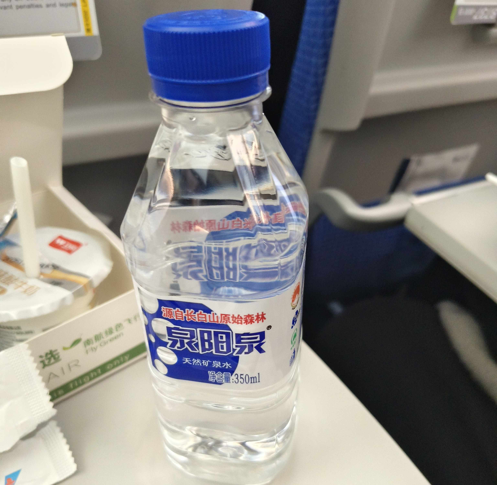
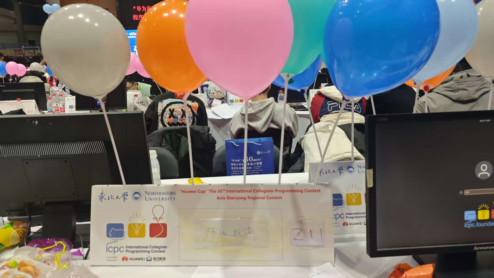
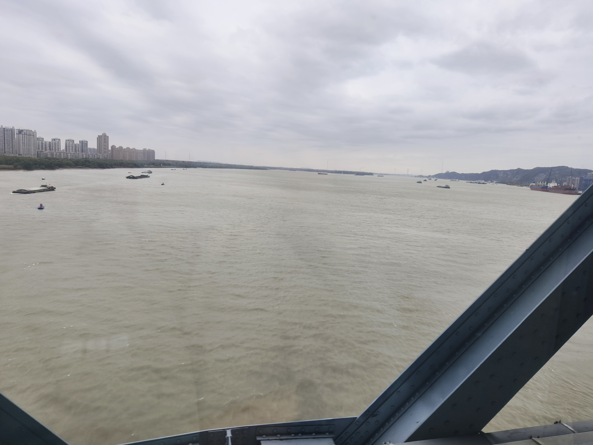

## 摘要

老年3人旅游团，~队友过了~6题，金。

## Day -7, 11/7/25, Fri

我爸来打南京站，晚上到万达茂吃饭，我说起全组都是AP，可以开打星旅游团。我爸说认识沈阳站的人，去要打星名额。沈阳站让等消息到周四。

## Day 0, 11/14/25, Fri

周中Dew老师来活，说恐怕没空旅游。周四仍没有消息，以为开团失败，故Dew老师暂缓干活。

周五沈阳站来消息，称有打星名额，不过由于报名太晚，没有胸牌和桌牌。此时Dew老师活干不完，师兄qkoqhh周末有事，截截的熟人也无人有空。于是我找了高中同学txz，我虽高中时与其接触不多，但知其水平较高，本科期间因没有队友所以只有银牌，现在北京工作。

> 另一只网瘾同学：我去，怎么不叫我
> 
> 我：您不是有正式名额吗
> 
> 网瘾同学：我想打十场

~烦请有类似想法的同学自觉左转杨永信~

队名叫阿比拔斯，是截截起的，因为我提过早年老家市面多有假冒产品如"abibas"，小学的一个班级买了"abibas"做班帽。

我爸禁止我们乱写学校，但三人不在一个学校，最终写了我爸所在的大学。

> 我：写你学校不怕领导看见吗
>
> 我爸：没事，全校只有我看得懂榜

截截称西交有给红名买娃哈哈饮料的风俗，请求若自己通过半数及以上题目，且通过人数最少的题由自己AC，则要喝爽歪歪。

## Day 1, 11/15/25, Sat

中午的飞机，下午3点到沈阳。

飞机上的矿泉水是吉林省特产泉阳泉，截截不喜欢喝，我觉得还行。

下飞机后机场的路人口音非常重，我能听懂，但还是大受震撼。

当天沈阳雾霾比较严重。本来想先领物资再去酒店的，但到了市区发现时间还早，于是改目的地到酒店。酒店在三好街上，司机师傅一直骂三好街堵车，但实际上不太堵。

三好街双向每边3车道，两边都是高楼大厦。天色渐晚，街的一边琴行亮了灯，另一边倒闭的电脑城贴着褪色的宣传画。

三好街的人行道和非机动车道没被道牙子隔开，步行体验不太好。

比赛地点是东北大学，校名是张学良写的。学校在市中心，但面积不算小。

场地是刘长春体育馆，对面是一片草地，草地上有个几层楼高的火箭模型。

学校还有一个球馆和一个游泳馆。学校图书馆的灯居然是无频闪的，比呢喃不知道高到哪里去了。

学校有个带塔尖的楼，和蛤工、东林、黑中医的主楼相似。

我有个小学同学为患全班，升入初中后被一狠人制服，这个狠人本科考上东北大学。我有幸和这个狠人有些交集，但没有联系方式。

物资是水绿色棉马甲，我们来的时候小码都发完了，只能拿了一件L和两件XL。旁边非凸投壶送挂件，我去搞了一个舞萌挂件，但我不玩舞萌。

-----

报名较晚，桌牌是手写的。

热身赛t1是个通信题，t2t3很简单，t4是个计算几何，txz想了个抽象做法，但一直WA，就走了。

学校附近有条饭店一条街。截截想吃东北菜，我和txz以恐怖谷效应为由一致拒绝。最后吃了羊棒骨。

## Day 2, 11/15/25, Sun

大降温，雾霾消散，还下了小雪。

沈阳的行道树既有银杏又有红松。一些银杏树枝上倒挂着张开的透明雨伞，伞里装着银杏落叶。不过有的伞被风吹得只剩骨架，感觉有安全隐患。

没有胸牌，出入场地不太方便。好在第一天已经和门卫志愿者混了个脸熟，上厕所没受影响。

---

只有一份中文题面，按惯例拆成3份各自找签到题。

开场几分钟看榜，发现有逝量的人通过I，截截看题发现是签到，写，WA。

此时我在看F，感觉F看上去可做，但没想出成形的思路。~~然后看到F数据范围300，觉得肯定是个大毒瘤，于是放弃。~~

截截I题WA两次后所有人一起看I，我发现是低级错误，AC。

此时M和B有人通过，M人数较多。截截发现M是大模拟，先去写M。此时txz去看B，想了个贪心做法讲给我听，但我听不懂。我又自己想了一下认为这个贪心是对的，考虑到B的代码较短，txz上机写B，AC。

截截的M题写完但过不去样例，和txz讨论后发现题读错了，于是去修改。

此时有人过K，我和txz看K但都没什么思路。txz由于热身赛AC了通信题，去看通信题C。

> 我：前n个位置放1到n
> 
> txz：同意。中间n个位置把1到n左移k次，放k,k+1,...1,...k-1，解码拿到01串之后看前n个位置的串左移几次能得到中间n个位置
> 
> 我：次数不唯一怎么办，比如0101和1010，只要左移奇数次就行
> 
> txz：这个东西叫循环节

此时截截AC M，看榜F有人过，于是截截去看F ~~(我：数据范围300,一看就不能做)~~ 。我接着想K，发现K诈骗题的本质，写，AC。

> 截截：F如果两点最短距离大于1则直接完事
> 
> 我：~~这点我居然没想到~~，剩下的情况应是一个“6”形的路线
>
> 截截：可以通过dfs树的返祖边得到这个路线
>
> 我：这不$O(n)$了吗...不过好像是对的

于是截截写F，AC。我去看G，不会。

txz想了一个C的抽象做法但一直WA，~~我没发现问题，给截截讲做法后~~截截发现漏了每个元素出现3次的条件。txz写了一个可以快速更换编码解码函数的框架，此时剩余时间不多，于是乱尝试函数，在离结束10min时截截想到一个方法，AC。结束后严格证出这个方法是正确的。

----

截截AC半数以上题目并AC C题，喜提爽歪歪。

其实5题就能Au，8发过C题让我们成了罚时最多的6题队。txz：以后写简历就说我有Au

出题人说F题确实有$O(n)$做法，但由于spj是$O(n^2)$，所以不卡时间。

---

没买到机票，坐16h的硬卧回南京。

火车经过南京长江大桥，长江很宽。

