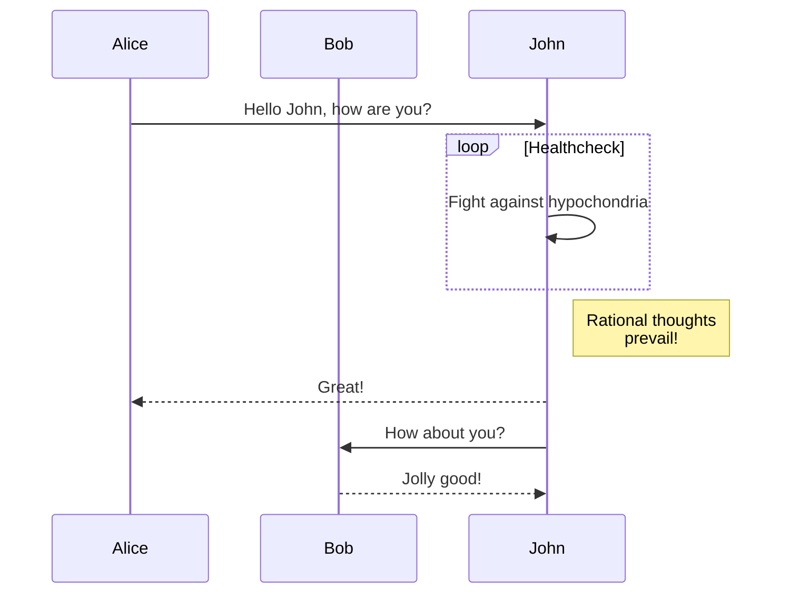
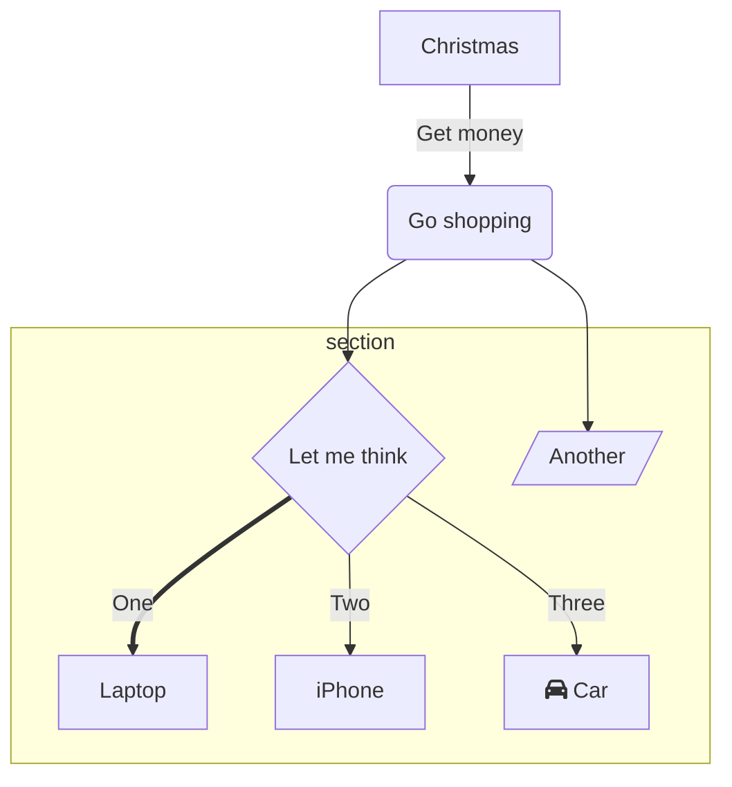

## 背景

我以前用Hexo下的[NexT主题](https://theme-next.js.org/)，它很华丽，但打开图片多的文章时巨卡无比[比如这篇](https://triccsr.github.io/62a2ca63/)。

这次我选择了[hugo-theme-stack](https://github.com/CaiJimmy/hugo-theme-stack)，主要是看中了gallery功能。

## 更改

### 大更改

为了方便改主题，我使用了git-submodule安装方式，然后把[starter](https://github.com/CaiJimmy/hugo-theme-stack-starter)里的config文件夹复制到自己的站点文件夹里。

我按照[hugo doc里的方法](https://gohugo.io/content-management/diagrams/#mermaid-diagrams)加了mermaid支持。





加了admonition，也叫alert。实现方式抄的[DoIt](https://github.com/HEIGE-PCloud/DoIt)里的admonition，样式与github alert 接近。效果如下：

```md

A **note** banner



A **tip** banner



An **important** banner



A **warning** banner



A **caution** banner

```


A **note** banner



A **tip** banner



An **important** banner



A **warning** banner



A **caution** banner


也可以不加type和title，默认type为note，title为type，效果如下：
```md

Default



default tip

```

Default



Default tip


### 小更改

小的更改被我放在了site文件夹下。

把链接改成了蓝色，改了代码的字体和字号。

## 问题

- [ ] 暗色模式没法被dark reader识别。

- [x] mermaid的颜色没法随着亮色/暗色模式的切换而切换。（DoIt也有这个问题，于是我写了一个亮暗都能看清~~不过很丑~~的mermaid主题）

- [ ] 目录没法自动折叠。


