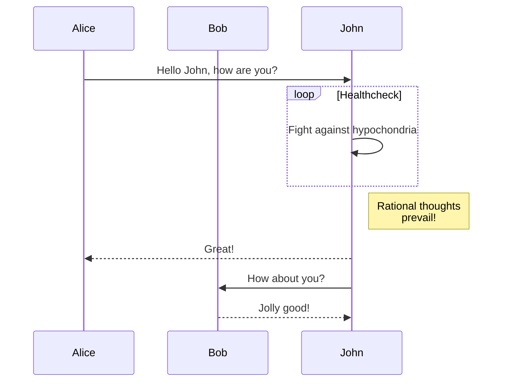
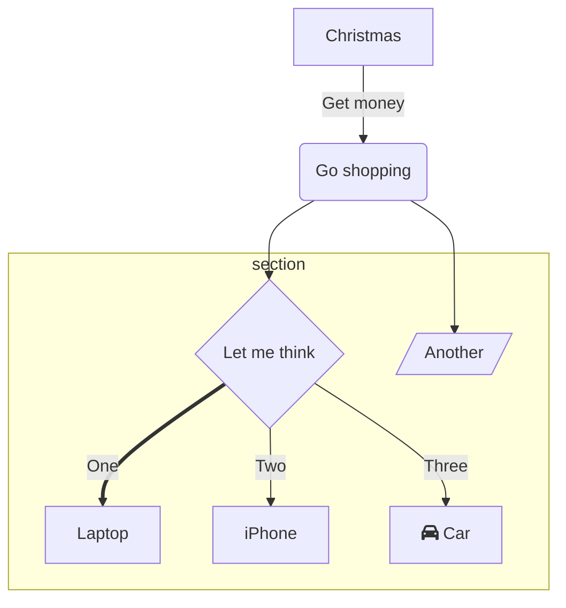

+++
title = 'My First Post'
date = 2024-04-14T21:17:32+08:00
draft = true
+++

> [!NOTE]
> Useful information that users should know, even when skimming content.

> [!TIP]
> Helpful advice for doing things better or more easily.

> [!IMPORTANT]
> Key information users need to know to achieve their goal.

> [!WARNING]
> Urgent info that needs immediate user attention to avoid problems.

> [!CAUTION]
> Advises about risks or negative outcomes of certain actions.

## meow

```cpp
#include <iostream>

int main(){
    cout<<"hello"<<endl;
    return 0;
}
```
## bark

dfkjsdk






Lorem ipsum dolor sit amet, consectetur adipiscing elit, sed do eiusmod tempor incididunt ut labore et dolore magna aliqua. Ut enim ad minim veniam, quis nostrud exercitation ullamco laboris nisi ut aliquip ex ea commodo consequat. Duis aute irure dolor in reprehenderit in voluptate velit esse cillum dolore eu fugiat nulla pariatur. Excepteur sint occaecat cupidatat non proident, sunt in culpa qui officia deserunt mollit anim id est laborum.



A **note** banner



A **tip** banner



An **important** banner



A **warning** banner



A **caution** banner



A **info** banner




A **danger** banner



A **bug** banner
