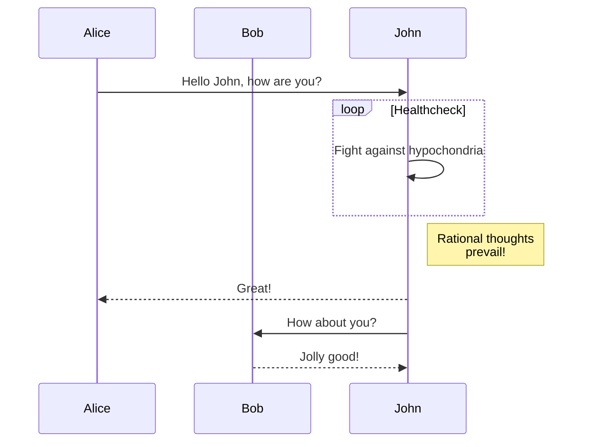
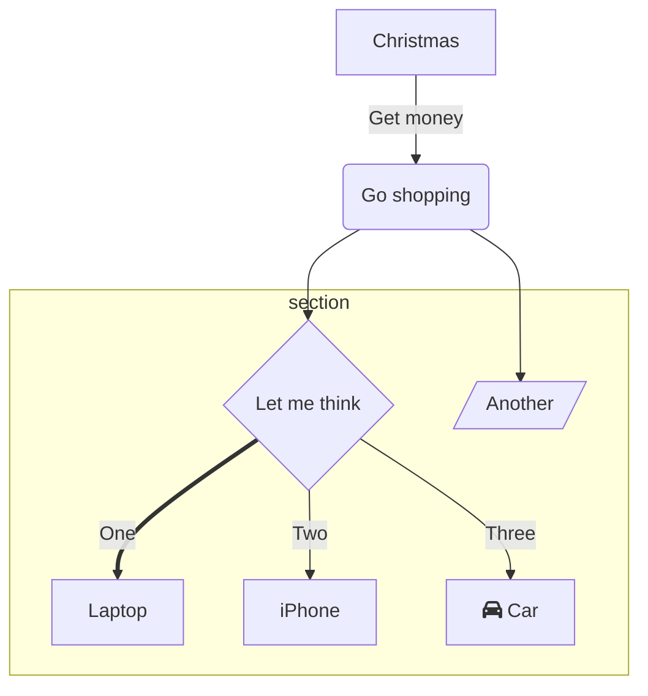

## 背景

我以前用Hexo下的[NexT主题](https://theme-next.js.org/)，它很华丽，但打开图片多的文章时巨卡无比[比如这篇](https://triccsr.github.io/62a2ca63/)。

这次我选择了[hugo-theme-stack](https://github.com/CaiJimmy/hugo-theme-stack)，主要是看中了gallery功能。

## 使用

为了避免重蹈[qkoqhh大佬](https://qkoqhh.github.io/)，[Dew老师](https://butterflydew.github.io/)等神仙们搭了博客却忘了怎么用的覆辙，有必要记录一下博客的用法。

前置软件：Hugo extended version

[github仓库链接](https://github.com/triccsr/triccsr.github.io)，`git clone`到本地就可以新建/修改文章，`git push`回去就可提交更改。

Hugo主题是用github submodule安装的[我修改过的hugo theme stack主题](https://github.com/triccsr/hugo-theme-stack)，[原主题链接](https://stack.jimmycai.com/)

已有的文章在路径`REPO_ROOT_DIR/content/post`中，每个文件夹代表一篇文章，文字内容在`index.md`中。

新建文章在仓库根目录下运行`hugo new content post/NEW_POST_TITLE/index.md`。

本地测试在仓库根目录下运行`hugo server -D`，网址为[localhost:1313](localhost:1313)

病猫使用搜索引擎的习惯是中文用bing，英文用google，所以博客seo只设了google和bing。新建/更改文章之后，google可以通过[google search console](https://search.google.com/search-console/about)中的url inspection提交被更新的文章链接，google爬虫速度较快，一般几分钟就能爬完。bing的爬虫速度慢，如果只提交链接要等几个小时才更新，但可以使用bing content submission api手动提交网页内容。

下面是一个使用bing content submission api的python脚本。使用方法为调用`bing_content_submit(网站URL,文章URL,自己的bing API key)`。bing API key可以在[bing webmaster tools](https://www.bing.com/webmasters/home)右上角的settings-api access中获取。

```python
import urllib.request
import time
import base64
import requests

def bing_content_submit(siteUrl:str, link:str,bingApiKey:str):
    f = urllib.request.urlopen(link)
    htmlContent = str(f.read().decode('utf-8'))
    currentTime=time.strftime("%a, %d %b %Y %H:%M:%S %Z",time.gmtime())
    fakeResult="HTTP/1.1 200 OK\n"+"Date: "+currentTime + "\nAccept-Ranges: bytes\nConnection: close\nContent-Type: text/html\n\n"+htmlContent

    httpMessage=base64.b64encode(fakeResult.encode("utf-8")).decode()

    bingUrl="https://ssl.bing.com/webmaster/api.svc/json/SubmitContent?apikey={}".format((bingApiKey))

    headers = {
        "Content-Type": "application/json; charset=utf-8"
    }

    # Request payload
    payload = {
        "siteUrl": siteUrl,
        "url": link,
        "httpMessage": httpMessage,
        "structuredData": "",
        "dynamicServing": "0"
    }

    response=requests.post(url=bingUrl,headers=headers,json=payload)

    print(response.text)
```

## 更改

### 大更改

为了方便改主题，我使用了git-submodule安装方式，然后把[starter](https://github.com/CaiJimmy/hugo-theme-stack-starter)里的config文件夹复制到自己的站点文件夹里。

#### mermaid

我按照[hugo doc里的方法](https://gohugo.io/content-management/diagrams/#mermaid-diagrams)加了mermaid支持。





#### admonition(alert)

加了admonition，也叫alert。实现方式基于[DoIt](https://github.com/HEIGE-PCloud/DoIt)里的admonition。样式与github alert 接近。

现支持以下种类

github alert:

> [!NOTE]
> Useful information that users should know, even when skimming content.

> [!TIP]
> Helpful advice for doing things better or more easily.

> [!IMPORTANT]
> Key information users need to know to achieve their goal.

> [!WARNING]
> Urgent info that needs immediate user attention to avoid problems.

> [!CAUTION]
> Advises about risks or negative outcomes of certain actions.

部分mkdocs

> [!INFO]
> info

> [!question]
> question

> [!danger]
> danger

> [!bug]
> bug

##### 使用hugo自带的alert

由于hugo自带的alert和github alert一样基于markdown的blockquote，我把stack的blockquote样式从贴边改为了不贴边。

无标题

```md
> [!NOTE]
> Useful information that users should know, even when skimming content.

> [!TIP]
> Helpful advice for doing things better or more easily.


```

有标题（真正的github alert不支持）

```md
> [!WARNING]+ Radiation hazard
> Do not approach or handle without protective gear.
```

> [!WARNING]+ Radiation hazard
> Do not approach or handle without protective gear.

##### 使用hugo shortcode

```md

A **note** banner



A **tip** banner


```

也可以不加type和title，默认type为note，title为type，效果如下：

```md

Default



default tip

```

Default



Default tip


### 小更改

小的更改被我放在了site文件夹下。

把链接改成了蓝色，改了代码的字体和字号。

## 问题

- [ ] 暗色模式没法被dark reader识别。

- [x] mermaid的颜色没法随着亮色/暗色模式的切换而切换。（DoIt也有这个问题，于是我写了一个亮暗都能看清~~不过很丑~~的mermaid主题）

- [ ] 目录没法自动折叠。


