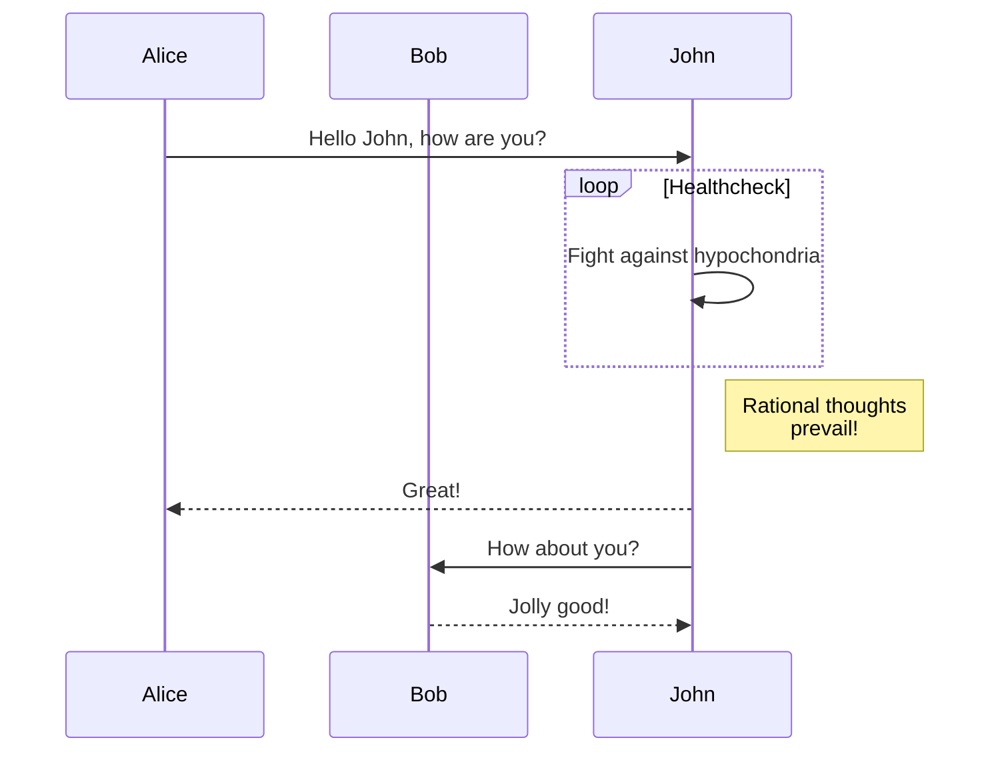
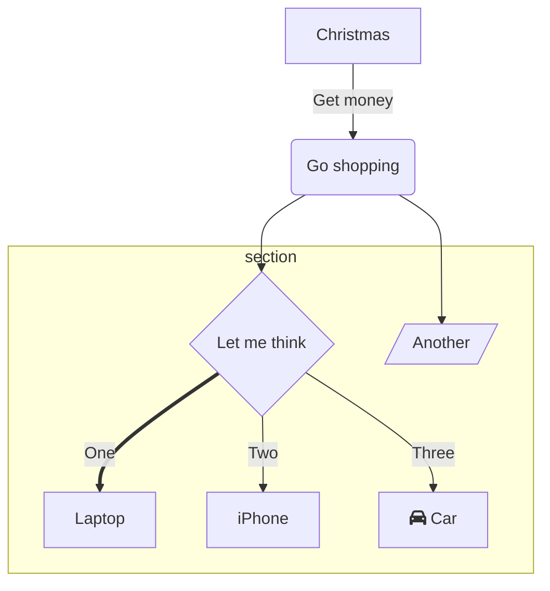

## 背景

我以前用Hexo下的[NexT主题](https://theme-next.js.org/)，它很华丽，但打开图片多的文章时巨卡无比[比如这篇](https://triccsr.github.io/62a2ca63/)。

这次我选择了[hugo-theme-stack](https://github.com/CaiJimmy/hugo-theme-stack)，主要是看中了gallery功能。

## 使用方式

为了避免重蹈[qkoqhh](https://qkoqhh.github.io/)，[Dew](https://butterflydew.github.io/)等大佬搭了博客却忘了怎么用的覆辙，有必要记录一下博客的用法。

### 安装

前置软件：Hugo extended version

[github仓库链接](https://github.com/triccsr/triccsr.github.io)，`git clone`到本地就可以新建/修改文章，`git push`回去就可提交更改。

Hugo主题是用github submodule安装的[我修改过的hugo theme stack主题](https://github.com/triccsr/hugo-theme-stack)，[原主题链接](https://stack.jimmycai.com/)

### 目录结构

已有的文章在路径`REPO_ROOT_DIR/content/post`中，每个文件夹代表一篇文章，文字内容在`index.md`中。

新建文章在仓库根目录下运行`hugo new content post/NEW_POST_TITLE/index.md`。

本地测试在仓库根目录下运行`hugo server -D`，网址为[localhost:1313](localhost:1313)

## 优化

### admonition(alert)

hugo 0.134.0开始支持原生alert。我用这种方式实现stack的alert功能。

css和html代码抄袭自[LoveIt主题](https://hugoloveit.com/)里的admonition。

#### 实现

由于hugo的原生alert基于markdown的blockquote，我把stack的blockquote样式从贴边改为了不贴边。

在`assets/scss/partials/layout/article.scss`的Negative margins一段注释掉blockquote。（我不喜欢negative margin就全注释掉了）

```scss
/// Negative margins
// blockquote,
figure,
.highlight,
pre,
.gallery,
.video-wrapper,
.table-wrapper,
.s_video_simple {
    margin-left: calc((var(--card-padding)) * -1);
    margin-right: calc((var(--card-padding)) * -1);
    width: calc(100% + var(--card-padding) * 2);
}

```

新建文件`layouts/_default/_markup/render-blockquote.html`，判断一个blockquote是否是alert，从而分情况渲染。

```html
{{ $emojis := dict
    "caution" ":exclamation:"
    "important" ":information_source:"
    "note" ":information_source:"
    "tip" ":bulb:"
    "warning" ":information_source:"
  }}
  
  {{ if eq .Type "alert" }}
    <div class="details admonition {{ .AlertType }}">
      <div class="details-summary admonition-title">
        <span class="icon">
          {{- partial "helper/icon.html" ((print "admonition-" .AlertType) | default (print "admonition-" "note")) -}}
        </span>
        {{ with .AlertTitle }}
          {{ . }}
        {{ else }}
          {{ or (i18n .AlertType) (title .AlertType) }}
        {{ end }}
      </div>
      <div class="details-content">
        <div class="admonition-content">
            {{ .Text }}
        </div>
    </div>
      
    </div>
  {{ else }}
    <blockquote>
      {{ .Text }}
    </blockquote>
  {{ end }}
```

新建文件`assets/scss/admonition.scss`。

```scss
// ========== Admonition ========== //
// Color map of the admonition
$admonition-color-map: (
  'important':#8e54fa,
  'caution':#da3633,
  'note': #448aff,
  'abstract': #00b0ff,
  'info': #00b8d4,
  'tip': #00bfa5,
  'success': #00c853,
  'question': #64dd17,
  'warning': #ff9100,
  'failure': #ff5252,
  'danger': #ff1744,
  'bug': #f50057,
  'example': #651fff,
  'quote': #9e9e9e,
  ) !default;

.admonition {
  position: relative;
  margin: 1em 0;
  padding: 0 .75em;
  border-left: var(--blockquote-border-size) solid map-get($admonition-color-map, 'note'
  );

overflow: auto;
//border-radius: 10px;
// border-top-right-radius: 6px;
// border-bottom-right-radius: 6px;

.admonition-title {
  font-weight: 700;
  margin: 0 -0.75em;
  padding: .25em 2em;
  color: map-get($admonition-color-map, 'note');
}

.admonition-content {
  padding: .5em 0;
  padding-top: 0;

  &>p {
    margin: 0 0;
  }
}

svg.icon {
  display: inline-block;
  width: 1.5em;
  vertical-align: -0.125em;
}

span.icon>svg {
  font-size: 0.85em;
  color: map-get($admonition-color-map, 'note');
  position: absolute;
  top: .55em;
  left: .6em;
}

span.details-icon>svg {
  position: absolute;
  top: .6em;
  right: .3em;
}

@each $type, $color in $admonition-color-map {
  &.#{$type} {
    border-color: $color;

    span.icon>svg {
      color: $color;
    }

    .admonition-title {
      color: $color;
    }
  }
}

&:last-child {
  margin-bottom: .75em;
}
}
```
#### 用法

alert的类型不区分大小写。

```md
> [!nOTe]
> Useful information that users should know, even when skimming content.

> [!tiP]
> Helpful advice for doing things better or more easily.

```
> [!NOTE]
> Useful information that users should know, even when skimming content.

> [!Tip]
> Helpful advice for doing things better or more easily.

带标题的alert（真正的github alert不支持）

```md
> [!WARNING]+ Radiation hazard
> Do not approach or handle without protective gear.
```

> [!WARNING]+ Radiation hazard
> Do not approach or handle without protective gear.


现支持github alert的全部样式以及mkdocs的部分样式

> [!NOTE]
> Useful information that users should know, even when skimming content.

> [!TIP]
> Helpful advice for doing things better or more easily.

> [!IMPORTANT]
> Key information users need to know to achieve their goal.

> [!WARNING]
> Urgent info that needs immediate user attention to avoid problems.

> [!CAUTION]
> Advises about risks or negative outcomes of certain actions.

> [!INFO]
> info

> [!Question]
> question

> [!danger]
> danger

> [!bug]
> bug


### SEO

新建/更改文章之后可以手动把网页提交给搜索引擎。

我使用搜索引擎的习惯是中文用bing，英文用google，所以博客seo只设了google和bing。

#### Google

google可以通过[google search console](https://search.google.com/search-console/about)中的url inspection手动提交被更新的文章链接。

google爬虫速度较快，提交后一般几分钟就能爬完。

#### Bing

bing的爬虫速度慢，如果只提交链接要等几个小时才更新，建议使用bing content submission api提交网页内容，用这个基本可以实时更新。

下面是一个使用bing content submission api的python脚本。使用方法为调用函数`bing_content_submit(网站URL,文章URL,自己的bing API key)`。bing API key可以在[bing webmaster tools](https://www.bing.com/webmasters/home)右上角的settings-api access中获取。

```python
import urllib.request
import time
import base64
import requests

def bing_content_submit(siteUrl:str, link:str,bingApiKey:str):
    f = urllib.request.urlopen(link)
    htmlContent = str(f.read().decode('utf-8'))
    currentTime=time.strftime("%a, %d %b %Y %H:%M:%S %Z",time.gmtime())
    fakeResult="HTTP/1.1 200 OK\n"+"Date: "+currentTime + "\nAccept-Ranges: bytes\nConnection: close\nContent-Type: text/html\n\n"+htmlContent

    httpMessage=base64.b64encode(fakeResult.encode("utf-8")).decode()

    bingUrl="https://ssl.bing.com/webmaster/api.svc/json/SubmitContent?apikey={}".format((bingApiKey))

    headers = {
        "Content-Type": "application/json; charset=utf-8"
    }

    # Request payload
    payload = {
        "siteUrl": siteUrl,
        "url": link,
        "httpMessage": httpMessage,
        "structuredData": "",
        "dynamicServing": "0"
    }

    response=requests.post(url=bingUrl,headers=headers,json=payload)

    print(response.text)
```

### mermaid

我按照[hugo doc里的方法](https://gohugo.io/content-management/diagrams/#mermaid-diagrams)加了mermaid支持。通过代码块渲染使用。

问题：mermaid配色不能根据亮色/暗色模式切换，所以我写了一个亮暗都能看的配色。

效果：





## 自定义外观


### 代码字体

可以在[](https://fonts.google.com)上选择字体，我使用了JetBrains Mono。

在站点文件夹（注意不是主题文件夹）下新建`layouts/partials/head/custom.html`。

```html
<style>
    /* Overwrite CSS variable */
    :root {
        --code-font-family: "JetBrains Mono";
    }

    code {
        font-size: 1.4rem; /* font size */
    }

    pre {
        font-size: 1.4rem; /* font size */
    }
</style>

<script>
    (function () {
        const customFont = document.createElement('link');
        customFont.href = "https://fonts.googleapis.com/css2?family=JetBrains Mono:wght@300;700&display=swap";

        customFont.type = "text/css";
        customFont.rel = "stylesheet";

        document.head.appendChild(customFont);
    }());
</script>
```

### dark reader

该主题的暗色模式无法被dark reader检测到。为了让dark reader闭嘴，我在文件`layouts/partials/head/head.html`里viewport下面加了一句`<meta name="color-scheme" content="dark">`。

```html
<meta charset='utf-8'>
<meta name='viewport' content='width=device-width, initial-scale=1'>
<meta name="color-scheme" content='dark'>
```
### category 和 tag 

默认主题的category五颜六色，不太好看。

#### 主页

把categories挪到下面去，使用`.article-time`（也就是阅读时间）的scss样式，并加上图标。下载的图标放入`assets/icons`。

tags同理。

在html文件中用`{{ partial "helper/icon" "assets/icons下的图标名" }}`调取图标。


为了让 categories 和 tags 在文章列表里右侧显示，点开文章后左侧换行显示，我在`assets/scss/partials/article.scss`里新增了`.article-time-wrapper`。

```scss
.article-time-wrapper {
    flex-direction: row;
    display: flex;
    justify-content: space-between;
}

.main-article {
    .article-time-wrapper {
        gap: 15px;
        flex-direction: column;
    }
}
```
还要改动`layouts/partials/article/components/details.html`的`{{ if $showFooter }}`一段：

```html
{{ if $showFooter }}
<footer class="article-time-wrapper">
    <footer class="article-time">
        {{ if $showDate }}
        <div>
            {{ partial "helper/icon" "date" }}
            <time class="article-time--published">
                {{- .Date | time.Format (or .Site.Params.dateFormat.published "Jan 02, 2006") -}}
            </time>
        </div>
        {{ end }}


        {{- if ne .Lastmod .Date -}}
        <div>
            {{ partial "helper/icon" "edit" }}
            <time class="article-lastmod">
                {{- .Lastmod.Format (or .Site.Params.dateFormat.published "Jan 02, 2006") -}}
            </time>
        </div>
        {{ end }}

        {{ if $showReadingTime }}
        <div>
            {{ partial "helper/icon" "clock" }}
            <time class="article-time--reading">
                {{ T "article.readingTime" .ReadingTime }}
            </time>
        </div>
        {{ end }}


    </footer>
    {{ if (or .Params.categories .Params.tags) }}
    <footer class="article-time">
        {{ if .Params.categories }}
        {{ range (.GetTerms "categories") }}

        <a class="article-class-category" href="{{ .RelPermalink }}" {{ with .Params.style
        }}style="background-color: {{ .background }}; color: {{ .color }};" {{ end }}>
            {{ partial "helper/icon" "categories-filled" }} 
            {{ .LinkTitle }}
        </a>

        {{ end }}
        {{ end }}

        {{ if .Params.tags }}
        {{ range (.GetTerms "tags") }}


        <a class="article-class-tag" href="{{ .RelPermalink }}" {{ with .Params.style
        }}style="background-color: {{ .background }}; color: {{ .color }};" {{ end }}>
            {{ partial "helper/icon" "tag-filled" }}
            {{ .LinkTitle }}
        </a>

        {{ end }}
        {{ end }}
    </footer>
    {{ end }}
</footer>
{{ end }}
```
#### 文章列表

stack 的文章列表里默认不显示 category 和 tag 。

改成显示需要在`layouts/partials/article-list/compact.html`里的`<footer class="article-time">`一段加入categories和tags的显示代码。

并且，原来的逻辑是整个卡片是一个指向文章的链接，但加入tag之后我们希望点击标题进入文章，点击tag进入tag。因此需要改动`layouts/partials/article-list/compact.html`。

我用`class="article-wrapper"`把文章卡片包了起来，并且更改了链接的指向。

```html
<article>
    <div class="article-wrapper">
        <div class="article-details">
            <a class="article-title" href="{{ .RelPermalink }}">
                {{- .Title -}}
            </a>
            <footer class="article-time">
                <time datetime='{{ .Date.Format "2006-01-02T15:04:05Z07:00" }}'>
                    {{- .Date.Format (or .Site.Params.dateFormat.published "Jan 02, 2006") -}}
                </time>

                {{ if .Params.categories }}
                {{ range (.GetTerms "categories") }}

                <a href="{{ .RelPermalink }}">
                    {{ partial "helper/icon" "categories-filled" }}
                    {{ .LinkTitle }}
                </a>
                {{ end }}
                {{ end }}

                {{ if .Params.tags }}
                {{ range (.GetTerms "tags") }}
                <a href="{{ .RelPermalink }}">
                    {{ partial "helper/icon" "tag-filled" }}
                    {{ .LinkTitle }}
                </a>
                {{ end }}
                {{ end }}
            </footer>
        </div>

        {{- $image := partialCached "helper/image" (dict "Context" . "Type" "articleList") .RelPermalink "articleList"
        -}}
        {{ if $image.exists }}
        <div class="article-image">
            {{ if $image.resource }}
            {{- $Permalink := $image.resource.RelPermalink -}}
            {{- $Width := $image.resource.Width -}}
            {{- $Height := $image.resource.Height -}}

            {{- if (default true .Page.Site.Params.imageProcessing.cover.enabled) -}}
            {{- $thumbnail := $image.resource.Fill "120x120" -}}
            {{- $Permalink = $thumbnail.RelPermalink -}}
            {{- $Width = $thumbnail.Width -}}
            {{- $Height = $thumbnail.Height -}}
            {{- end -}}

            
            {{ else }}
            
            {{ end }}
        </div>
        {{ end }}
    </div>
</article>
```

此外要添加`.article-wrapper`的scss，比如在custom.scss里加入：

```scss
.article-wrapper {
    display: flex;
    align-items: center;
    padding: var(--small-card-padding);
}
```


### 其他

[友链双列](https://oxidane-uni.github.io/p/%E4%BD%BF%E7%94%A8-hugo-%E5%AF%B9%E5%8D%9A%E5%AE%A2%E7%9A%84%E9%87%8D%E5%BB%BA%E4%B8%8E-stack-%E4%B8%BB%E9%A2%98%E4%BC%98%E5%8C%96%E8%AE%B0%E5%BD%95/#%E5%8F%8B%E6%83%85%E9%93%BE%E6%8E%A5%E6%94%B9%E4%B8%BA%E5%8F%8C%E5%88%97%E6%98%BE%E7%A4%BA)

[归档双列](https://www.xalaok.top/post/stack-modify/#%E5%BD%92%E6%A1%A3)

[代码块圆角](https://www.xalaok.top/post/stack-modify/#%E4%BB%A3%E7%A0%81%E5%9D%97)
