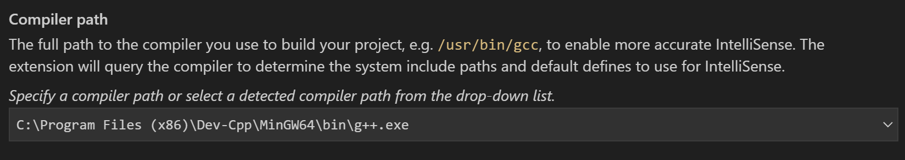
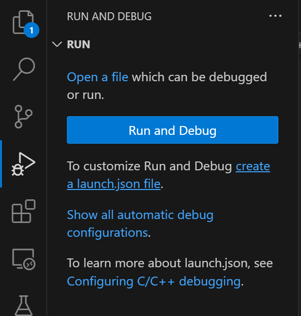
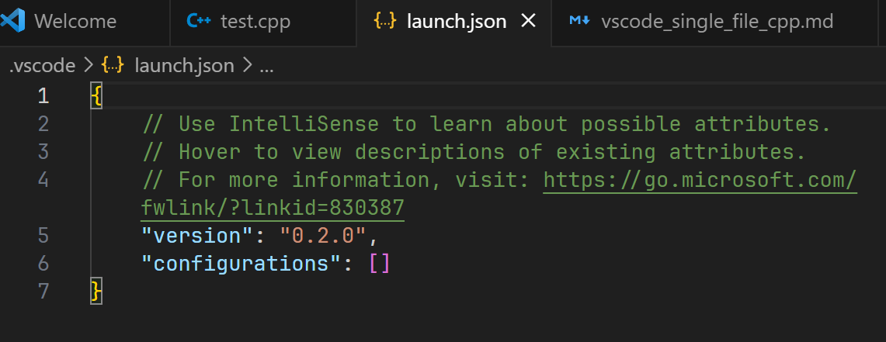

## 前置条件

- 电脑上有MinGW
- 电脑上有Visual Studio Code
- vscode上有Microsoft官方的C/C++插件

<!--more-->

## 背景

南京大学硕士夏令营机试开始之前，某人打开124机房的古董电脑上的vscode，简单写了个hello world，结果发现VSCode对着`#include <bits/stdc++>`报错"header not found"。(解决方法见下文)

机试开始，某人想调试代码，却发现gdb不太好使。

一切都结束之后，某人翻经验贴仓库，发现有相似问题的不只某人一个。

## 测试环境

- Win11 22H2
- Visual Studio Code 1.83.0
- 两个版本的C/C++toolchains
  - DevC++ 5.11自带的MinGW，其中g++版本为4.9.2，gdb版本为7.8.1（为了模拟124机房古董机器的编译器）
  - msys2 ucrt64 g++ 13.2.0, gdb 13.2 （某人创建文章时自用的版本）

## 使用方法

新建文件夹，用vscode打开，之后的所有操作都在该窗口中进行。

### C/C++ Configuration

按F1键，显示搜索框，输入C/C++，选择`C/C++: Edit Configurations(UI)`，将会出现新页面C/C++ Configurations，同时.vscode文件夹下出现新文件c_cpp_properties.json。



使用C/C++ Configurations页面编辑时，不能打开c_cpp_properties.json文件，否则进行的编辑将不被保存。



以下内容需要修改：

#### Compiler Path



这个是编译器路径，更改方式有如下两种：

1. 点击右侧箭头，打开下拉菜单，选择MinGW的g++（适用于g++在PATH中的情况）
2. 直接输入g++的路径，注意不要带引号



VSCode的编译器寻找顺序为MSVC -> GCC on WSL -> MinGW, 所以当电脑上有MSVC时默认编译器路径是MSVC路径，这是124机房电脑的vscode不认识`#include <bits/stdc++>`的原因。



#### Compiler Args


在框中输入编译器参数，每行一个。

某人一般使用:

```
-Wall
-Wextra
-Wconversion
-Wshadow
-std=c++11
```

其中`-Wconversion`是类型转换警告，`-Wshadow`是变量重名覆盖警告（某人经常犯变量重名错误，因此习惯加上），`-std=c++11`为c++版本。

#### IntelliSense Mode


这个选择windows-gcc-x64。

### C/C++ Version


这个是c和c++的版本，按需选择。


我用上述编译器版本测试，即使在C++ standard中选择了`c++11`，在编译带`c++11`特性的代码时仍报错，解决方案是在编译参数中加上`-std=c++11`


### 编写代码

没啥说的，在自己创建的文件夹里新建c/c++文件写就完了。

### 运行/调试

现在.vscode文件夹下只有c_cpp_properties.json一个文件。

#### tasks.json(必需)

**将vscode页面切换到想要运行的代码文件**，右上角如图所示：


点击下拉菜单，选择debug或run


会出现一个菜单


选择想要的编译器路径，选择完后.vscode文件夹下应出现tasks.json。

然后再点击debug C/C++ File或Run C/C++ File，就**有可能**可以正常运行或调试程序了。

正常情况下vscode会自动新建两个terminal，一个用于编译，一个用于运行。

使用快捷键ctrl+j打开panel，下面这个名字以`C/C++: g++.exe`开头的终端是编译用的，与我们无关：


下面这个名字为`cppdbg`的终端是运行程序的，我们在这里输入数据：


注意到panel里面还有一个debug console，调试时我们可以在里面输入式子。

如果还不能正常使用，请配置launch.json。

#### launch.json(非必需)


我使用DevC++自带的gdb7.8.1测试时，用vscode的集成终端无法输入数据，换成gdb13.2则没有此问题。解决方法是在launch.json中把`"externalConsole"`由`false`改为`true`，使用外部终端。
但这样外部终端会一闪而过看不见输出，解决方法：
  - 在代码的`main`函数的`return 0;`前面加上`system("pause");`，**在OJ提交时去掉这行**。
  - 运行程序时选择debug c/c++ file按钮，设置断点



##### 自动配置

点击右上角的齿轮图标，顶部会出现一个菜单


选择描述为g++.exe(Task generated by debugger)的（不出意外会排在第一个并显示Recently Used Task），.vscode下将会自动生成一个launch.json

##### 手动配置

**页面切换至c/c++代码文件**，点击侧边栏的 Run and Debug，点击create a launch.json file。



在弹出的菜单中选择C++(GDB/LLDB)，然后将生成一个新文件launch.json。初始如图所示：



点击右下角的 Add Configuration，选择 C/C++: (gdb) Launch。

然后将插入以下内容：

```json
{
    "name": "(gdb) Launch",
    "type": "cppdbg",
    "request": "launch",
    "program": "enter program name, for example ${workspaceFolder}/a.out",
    "args": [],
    "stopAtEntry": false,
    "cwd": "${fileDirname}",
    "environment": [],
    "externalConsole": false,
    "MIMode": "gdb",
    "setupCommands": [
        {
            "description": "Enable pretty-printing for gdb",
            "text": "-enable-pretty-printing",
            "ignoreFailures": true
        },
        {
            "description": "Set Disassembly Flavor to Intel",
            "text": "-gdb-set disassembly-flavor intel",
            "ignoreFailures": true
        }
    ]
}
```

其中"program"和"miDebuggerPath"是一定要改的。打开tasks.json，看到 args的-o后面有一行`"${fileDirname}\\${fileBasenameNoExtension}.exe"`，把program后面的内容改成这个。"miDebuggerPath"就是gdb的路径，注意在windows下要使用双反斜杠，最后形如这样：

```json
"program": "${fileDirname}\\${fileBasenameNoExtension}.exe",
"miDebuggerPath": "C:\\Program Files (x86)\\Dev-Cpp\\MinGW64\\bin\\gdb.exe",
```

配置完之后再点击右上角的run/debug按钮，不出意外应该可以正常运行。

## 参考资料

[Using GCC with MinGW](https://code.visualstudio.com/docs/cpp/config-mingw)

[C/C++ for Visual Studio Code](https://code.visualstudio.com/docs/languages/cpp)

[Debug C++ in Visual Studio Code](https://code.visualstudio.com/docs/cpp/cpp-debug)


