## 摘要

隔壁的电子楼出逝了，我从计科楼里跑路~~顺便看花~~。

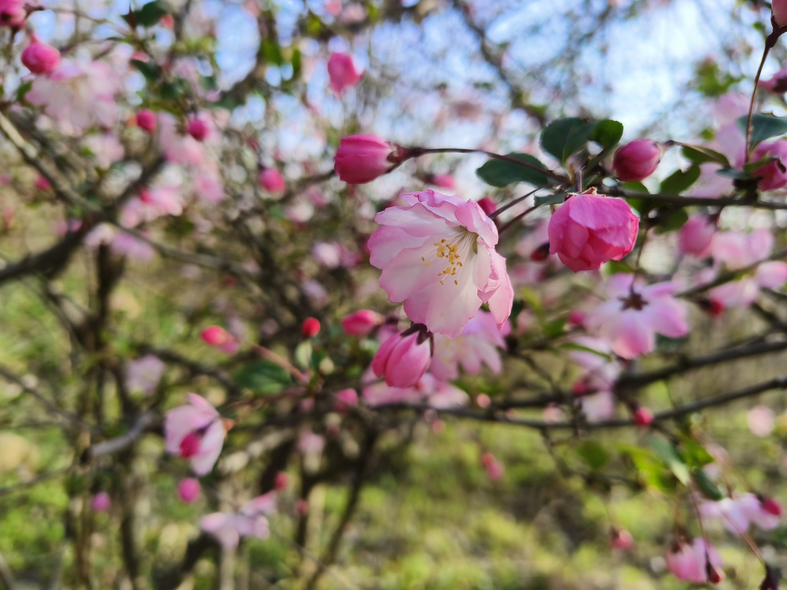

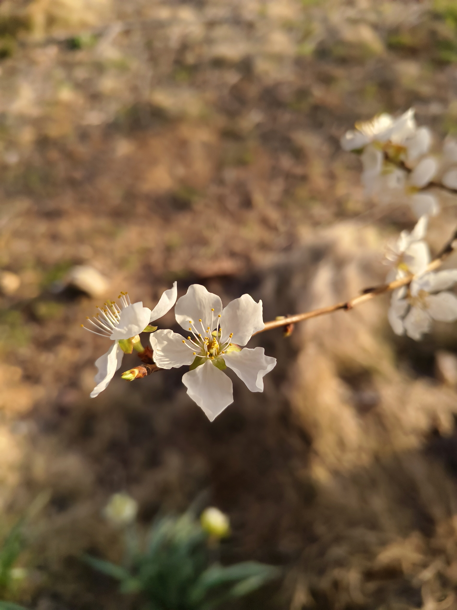

<!--more-->

## 玉兰

- 学校里到处都是
- 大树大花
- 有淡淡的香气
- 样貌与其他花区别较大，容易区分

### 白玉兰

#### 2024.3.12 50

4层楼高的玉兰树

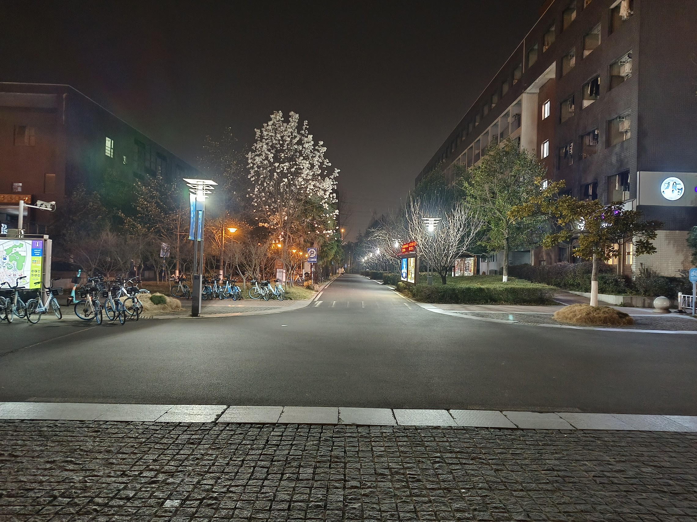

#### 2024.3.13 图书馆右侧

 

#### 2024.3.20 计科楼

#### 2024.3.21 

白玉兰快谢了，紫玉兰快开了，黄玉兰还没开。

上面摄于国际会议中心右侧，中间两张摄于医学院正门右侧，下面摄于1210旁边。

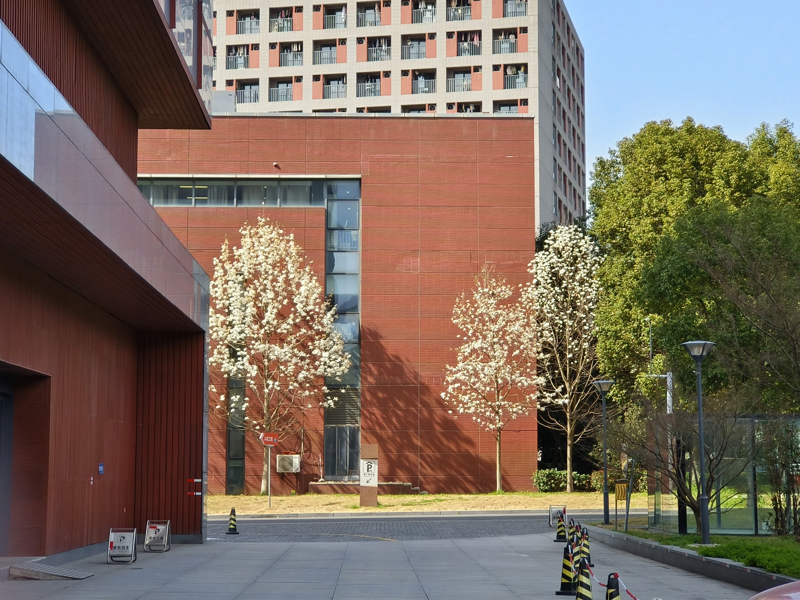

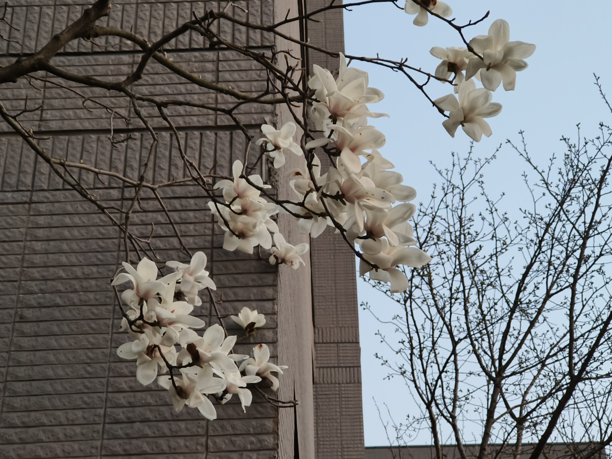

#### 2024.4.30 苏果

悲鸣：苏果门口的玉兰树被砍了。左图摄于2024.3.12

 

### 飞黄玉兰
- 淡黄色
- 花期较晚

#### 2024.3.30 行政南楼周围

飞黄玉兰初开

 

## 樱花

- 学校里较常见且不只一种,~~但我不太能区分各个品种，下述品种仅供参考~~
- 花梗较长，花瓣尖端有缺刻

据我观察，学校里的樱花大概分3种：

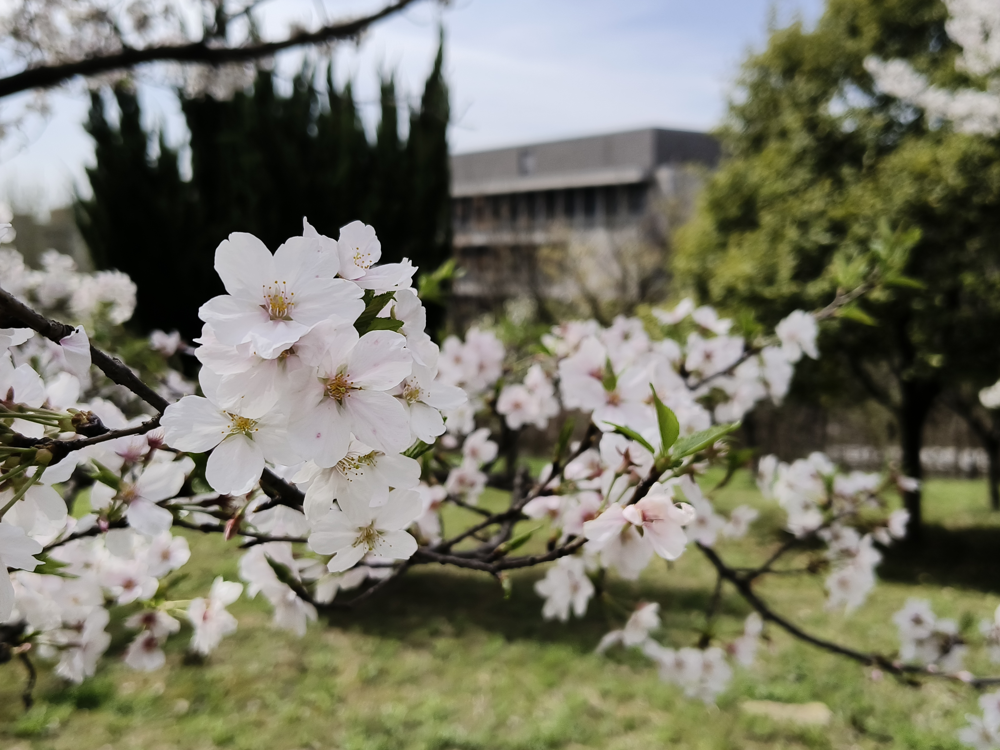

其中第一种花期最早，花最小，花蕊最长，与下面两种区别明显。

第二种和第三种花期相似，第二种稍早一点。

第二种花浅粉色，开花时叶子少；第三种花纯白色，开花时叶子多。

树的对比：

 

第一种几乎可以确定是樱桃，第二种大概率是东京樱花，第三种不同的识图软件会给出不同结果，不知道是什么。

### 樱桃 2024.3.13 远东大道2栋和菜根潭之间

- 花期最早
- 花较小，花蕊较长
- 花瓣尖端缺刻明显

 

### 第二种

- 花较大
- 花淡粉色
- 开花时少量绿叶

#### 2024.3.21 政管楼门前

#### 2024.3.24 朱共山楼后身

#### 2024.3.30 大气山

大气山的樱花林里面有两种樱花。

今天看第二种樱花的绝佳时机。一方面树上还有很多花，另一方面一吹风就有花瓣雨。

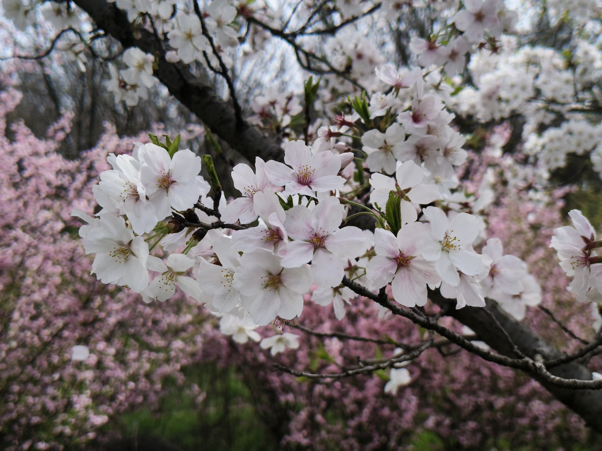 

### 第三种

- 花较大
- 花纯白色
- 开花时大量绿叶
- 有淡淡的清香

#### 2024.3.21 现工院门右侧，只看到一棵

咏曼阁东南边也有一棵几乎一样的树。

#### 2024.3.30 大气山

第二种樱花已经开始花瓣雨了，第三种樱花还比较坚挺。

 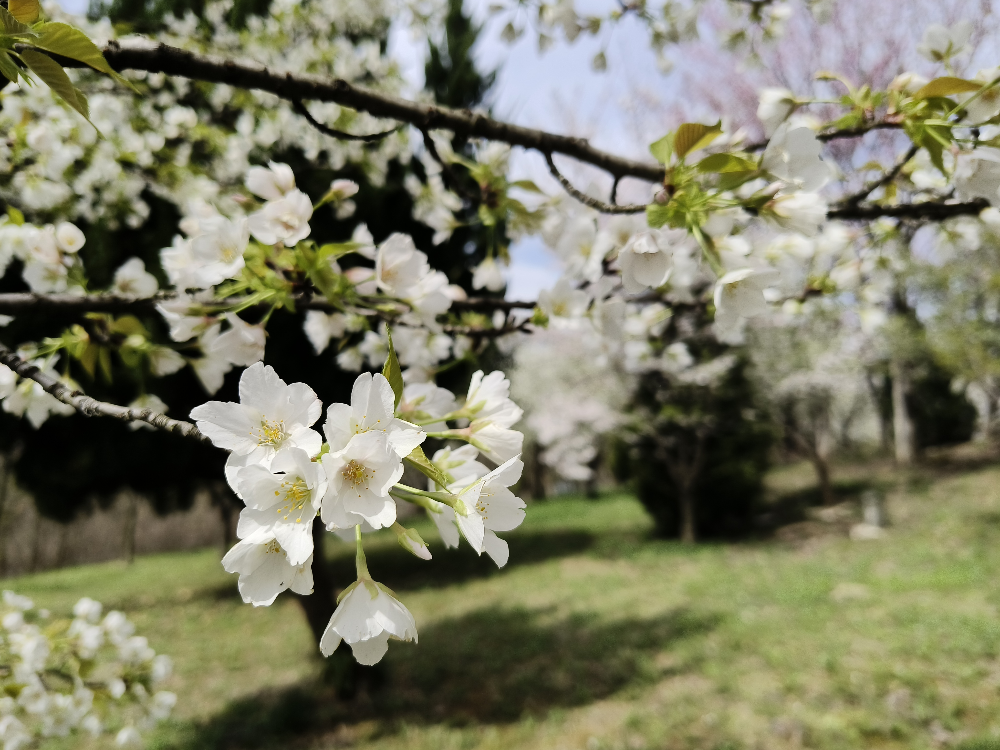

### 分不清是哪种的樱花

#### 2024.3.21 大气山

 

#### 2024.3.24 三组团

三组团有大量的樱花。~~但也有大量的石楠~~

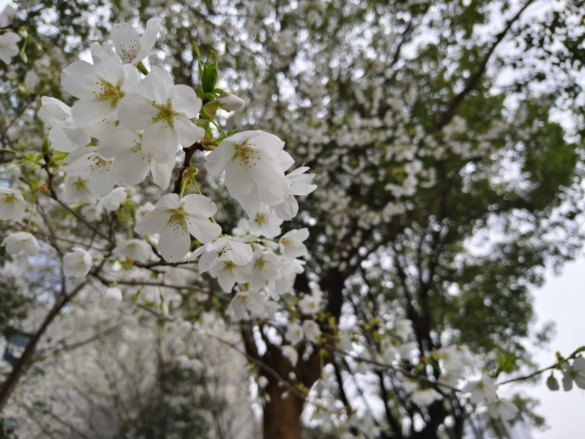

## 海棠

- 花梗较长
- 花叶同现
- 花不均匀的粉色
- 有较淡的气味，我觉得不香也不臭

### 垂丝海棠

- 学校里到处都是
- 花下垂
- 亮粉色很好看

#### 2024.3.21 大气山，还没开全

#### 2024.3.24 南门

 

#### 2024.3.28

六栋正门前面的坡上：

国际会议中心旁边：

行政北楼和行政南楼之间：

### 西府海棠

- 花期较垂丝海棠晚一点
- 花颜色较垂丝海棠浅，盛开的花接近白色
- 大部分花不下垂

#### 2024.3.23 图书馆正门左侧的路上

 

#### 2024.3.29 图书馆正门左侧的路上

 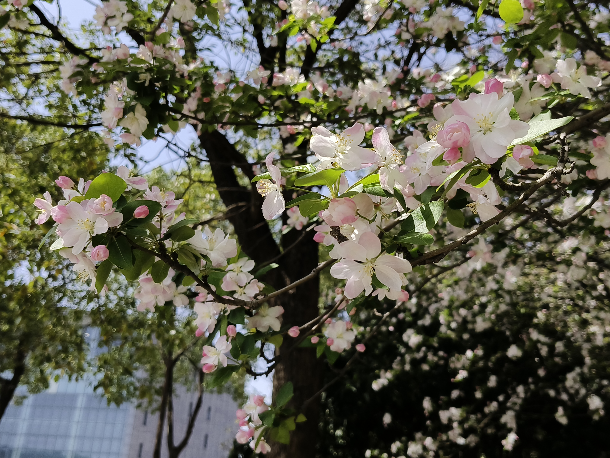

盛开的西府海棠树长下图这样，和上面的垂丝海棠树对比颜色差异非常明显。

### 一种单瓣海棠，不知道是西府海棠还是垂丝海棠

#### 2024.3.30 大气山海棠林，山脚红圈处

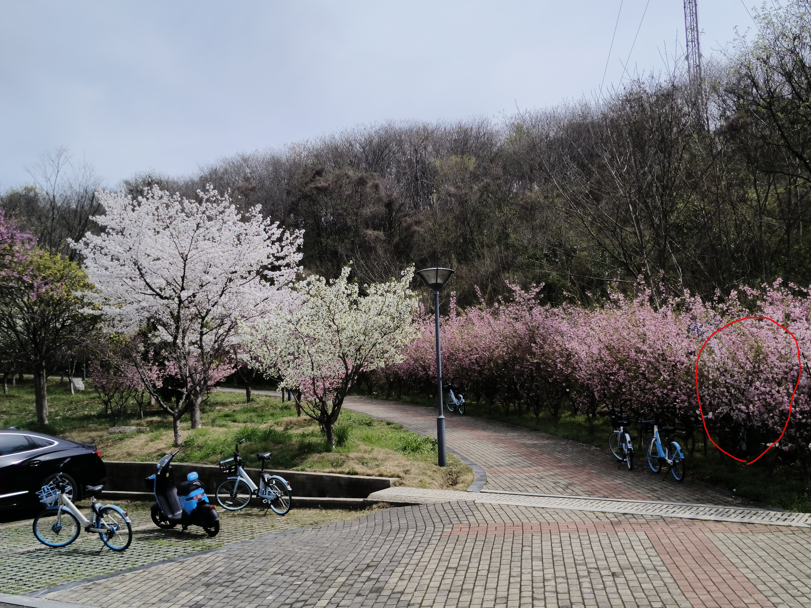 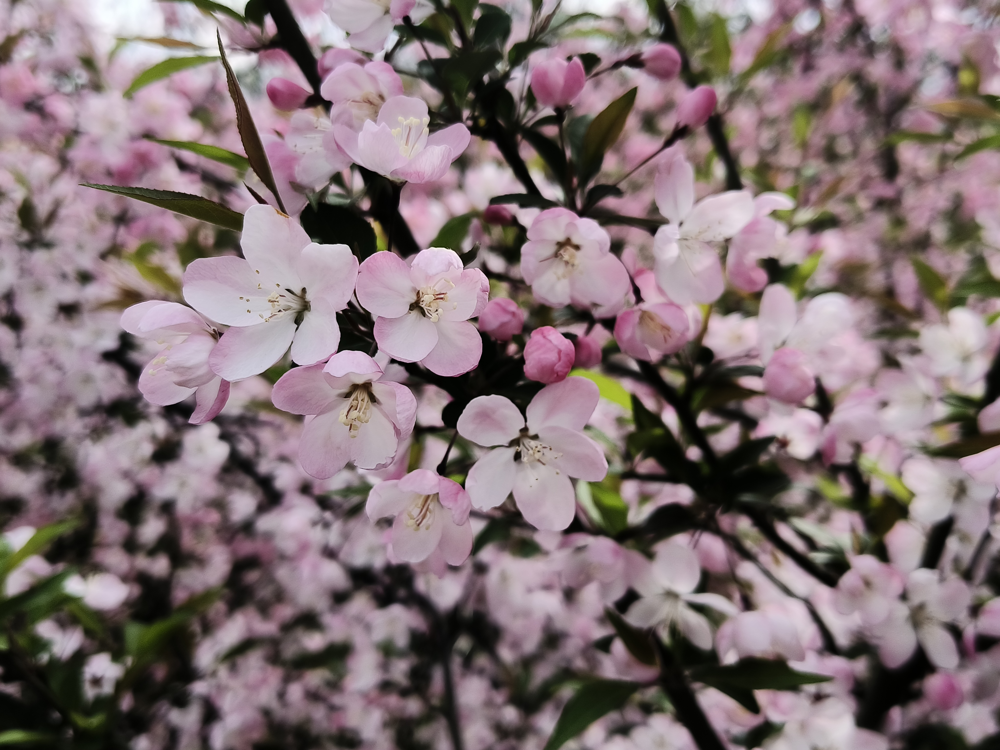

### 某种花苞淡粉色，花纯白色的海棠

#### 2024.3.31 四组团

 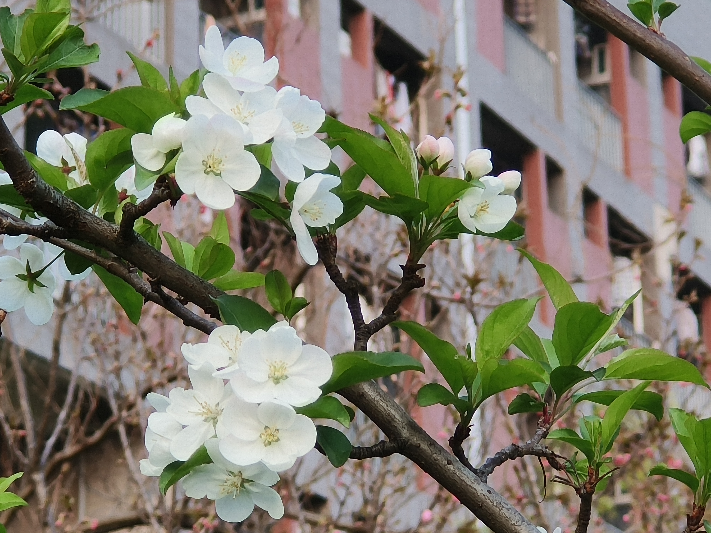

### 某种花苞和花都纯白的海棠

#### 2024.4.11 南门
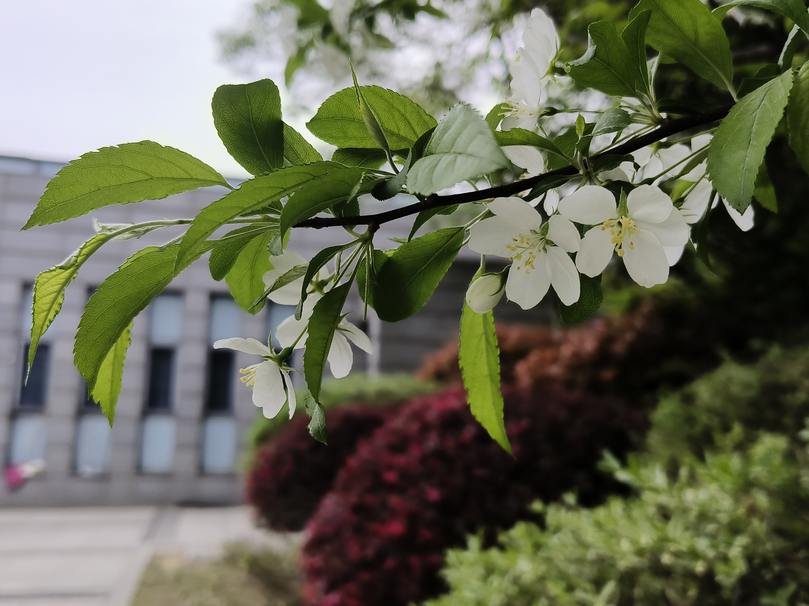

## 杜鹃

- 小灌木
- 花期长

学校里有两种杜鹃，一种大花粉紫色（据说叫锦绣杜鹃），一种小花粉红色。

对比：

### 锦绣杜鹃

#### 2024.4.16

#### 2024.4.24

 

### 小粉花杜鹃（不知道叫什么）

#### 2024.4.14 电子楼北

#### 2024.4.24
 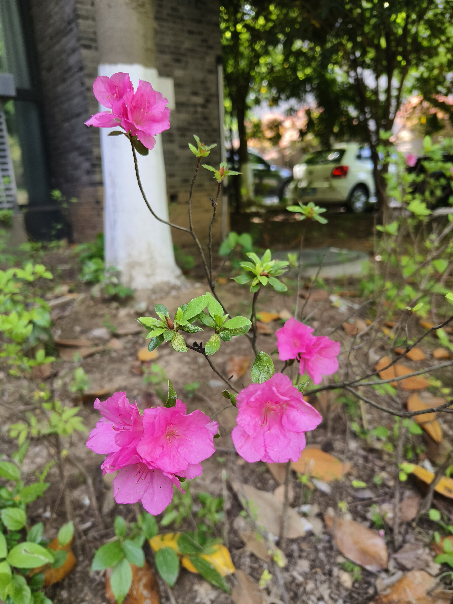

## 樟树

- 乔木，有的叶子偏橘红色
- 花小，几乎看不出是花，但很香
- 学校里到处都是，和园也有

 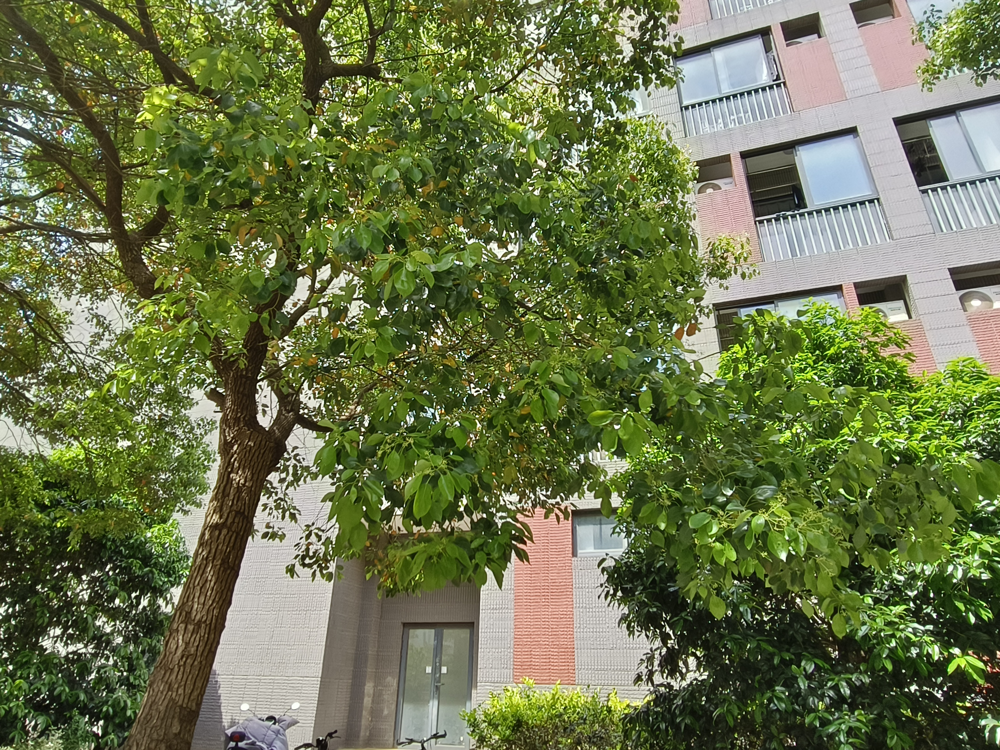

## 紫叶李

- 学校里到处都是
- 花较小，花梗长，花叶同现
- 有奇怪的气味，不好闻

### 2024.3.19

 

## 梅花

- 存在于图书馆门前和香雪海
- 有明显的甜香气，~~个人感觉有点腻~~
- 因为花期最早，很容易与其他花区分开

花期太早，我返校前已过了盛放期。

### 2024.3.11-12 图书馆附近

## 美人梅

- 据说是宫粉梅和紫叶李的杂交种
- 粉了吧唧的很好看
- 继承了紫叶李的奇怪气味

### 2024.3.20 远东大道图书馆段

 

### 2024.3.21 咏曼阁后身

## 紫荆

- 学校里较常见
- 花小
- 外观独特

### 2024.3.30 远东大道90段

 

## 蜡梅

- 花期早
- 淡黄花
- 明显香气

花期太早，我返校前已过了盛放期。

### 2024.3.12计科楼正门右侧

## 桃花

- 粉红色花，花心颜色较深
- 花梗短
- 花叶同现

#### 2024.3.26 菜根潭快递站路口 （其实前几天就开了，但3.21还没开）

  

### 紫叶桃花或红叶碧桃

#### 2024.3.31 4组团

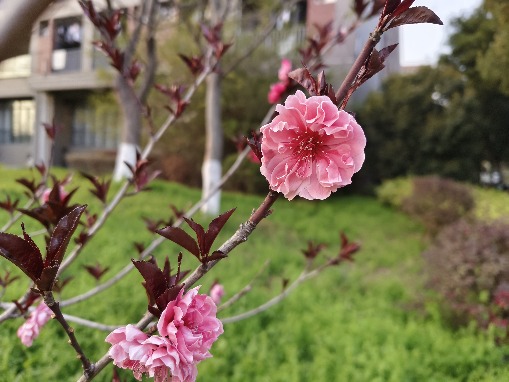 

## 杏花

- 花期很短
- 花梗短，花白色或很浅的粉色，花萼深红色，反折

学校里我只在图书馆正门右侧见过两棵杏树。

原来是有三棵杏树的，去年砍了一棵，剩下的两棵开的花也是一年不如一年。

我记得前年杏花开花的时候，花密密麻麻的满枝都是，今年只有枝梢上有几朵花。

### 2024.3.12 图书馆正门右侧

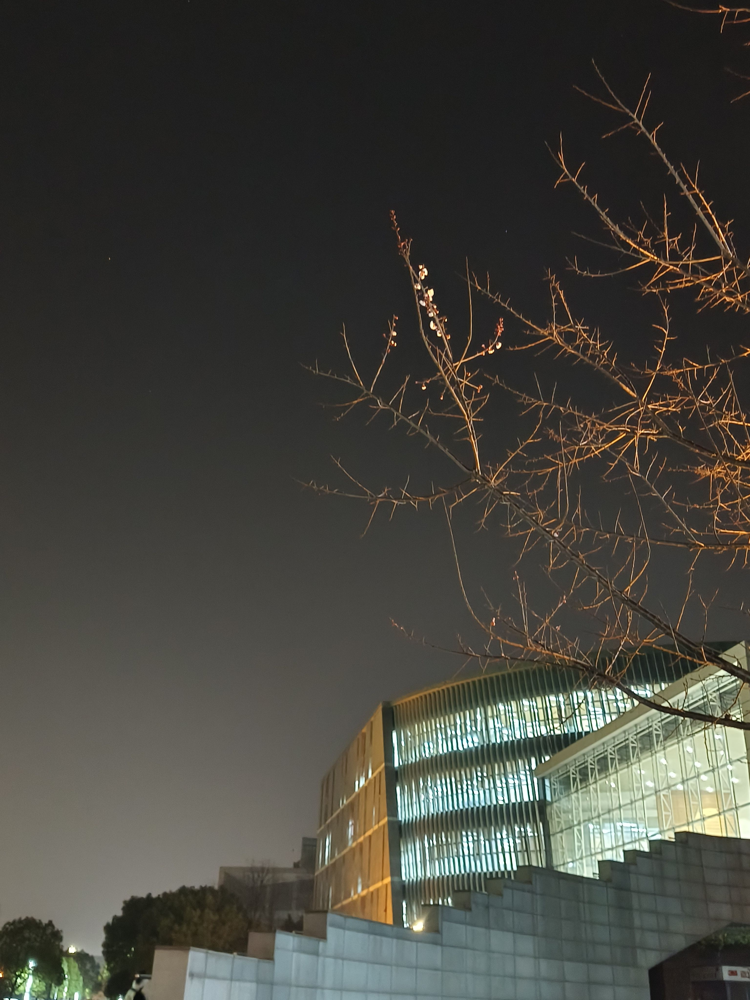 

## 鸢尾

### 2024.4.24 远东大道四组团段

 

## 山茶

### 2024.3.31 炜华和方肇周之间

  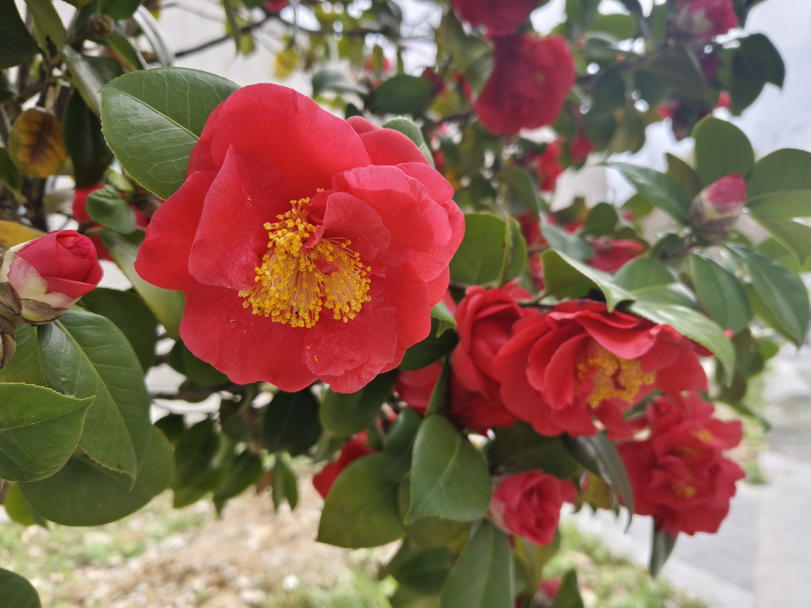

## 芍药

### 2024.4.24 远东大道生科院段

### 2024.4.24 新传院
 

## 重瓣棣棠花

- 金黄色，照片照不出来，但与其他黄花的颜色差异很明显
- 彼尔维何？维常之华。

### 2024.4.24

 

## 阔瓣含笑

- 和白玉兰，广玉兰同属木兰科
- 乔木，大花，花叶同现
- 有点像广玉兰，但广玉兰夏天开花
- 明显香气

### 2024.3.20 朱共山楼右侧

 

## 山桃（？一说山桃花药红色，但这种花花药黄色）

- 白花
- 有点像樱花？但花梗短，花较小，且花瓣尖端无裂

### 2024.3.21 新传院

 

## 诸葛菜

- 草本紫花

### 2024.3.21 敏学路

 

## 美丽月见草

一般的月见草只在晚上开，但美丽月见草白天也开。

### 2024.4.24 1110

### 2024.4.24 新传院后身的紫云海
图中的小粉花是美丽月见草

## 金钟花或连翘

- 趴地枝条上的小黄花，但比迎春花开得密，且花下垂似钟

基础实验楼附近的停车场附近也有。

### 2024.3.19 梦川快递站段 

## 七姊妹

- 爬藤
- 花簇生
- 亮粉色
- 香

### 2024.4.24 第二运动场
 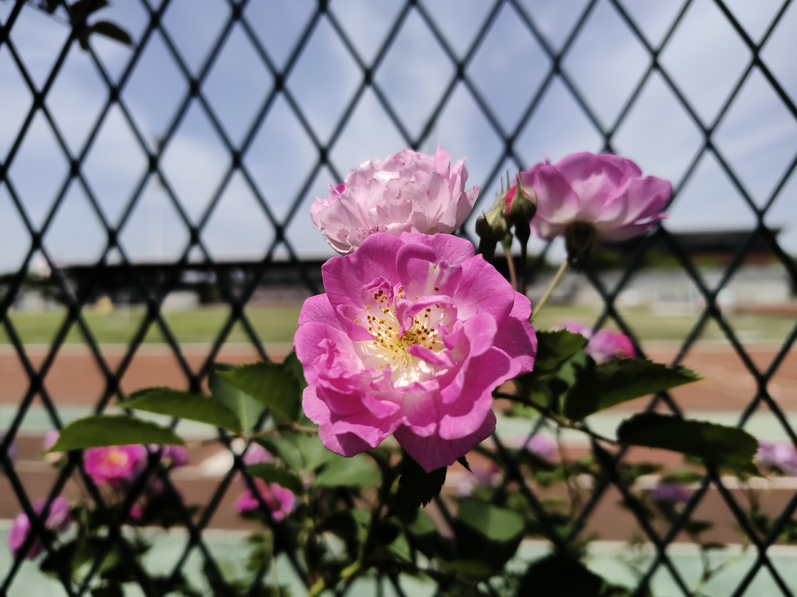

## 刺槐
### 2024.4.24 1110
 

## 月季

- 可能不算春花，因为一直开花

### 2024.3.20 南门到计科楼的路上

