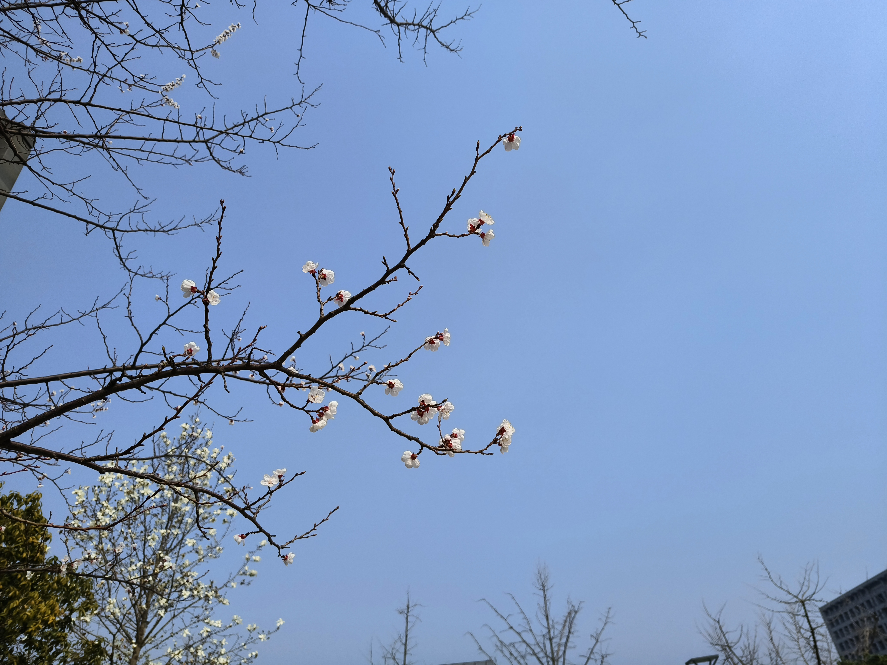
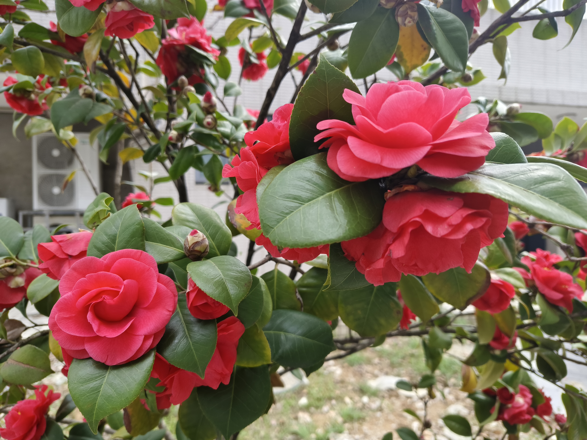

## 摘要

隔壁的电子楼出逝了，我从计科楼里跑路~~顺便看花~~。

## 玉兰

- 学校里到处都是
- 大树大花
- 有淡淡的香气
- 样貌与其他花区别较大，容易区分

### 白玉兰

#### 2024.3.12 50

4层楼高的玉兰树

#### 2024.3.13 图书馆右侧

 

#### 2024.3.20 计科楼

#### 2024.3.21 

白玉兰快谢了，紫玉兰快开了，黄玉兰还没开。

上面摄于国际会议中心右侧，中间两张摄于医学院正门右侧，下面摄于1210旁边。

#### 2024.4.30 苏果

悲鸣：苏果门口的玉兰树被砍了。右图摄于2024.3.12

 

### 飞黄玉兰
- 淡黄色
- 花期较晚

#### 2024.3.30 行政南楼周围

飞黄玉兰初开

 

## 桂花

- 学校里到处都是
- 非常明显的甜香
- 花期较短

感觉分两批开，第一批大概9月26日初开，第二批10月10日开。

非常香，非常香，非常香。

香气带一点酸，在热天像腐烂的水果不好闻，但天凉了就非常好闻。一般桂花开的时候天不会太热。

(update on 2025.10.31)
有说法是桂花没有明确的花期，而是等降温时开，我觉得有道理。2025年9月末短暂降温，第一批桂花开了，然后持续高温直到10月20日，此时第二批桂花才开。2021年也是十一后持续高温，仙林湖公园的桂花也是十月下旬盛开。

 

## 海棠

- 花梗较长
- 花叶同现
- 花不均匀的粉色
- 有较淡的气味，我觉得不香也不臭

### 垂丝海棠

- 学校里到处都是
- 花下垂
- 亮粉色很好看

#### 2024.3.21 大气山，还没开全

#### 2024.3.24 南门

 

#### 2024.3.28

六栋正门前面的坡上：

国际会议中心旁边：

行政北楼和行政南楼之间：

#### 2025.3.21 外院

### 西府海棠

- 花期较垂丝海棠晚一点
- 花颜色较垂丝海棠浅，盛开的花接近白色
- 大部分花不下垂

#### 2024.3.23 图书馆正门左侧的路上

 

#### 2024.3.29 图书馆正门左侧的路上

 

盛开的西府海棠树长下图这样，和上面的垂丝海棠树对比颜色差异非常明显。

### 一种单瓣海棠，不知道是西府海棠还是垂丝海棠

#### 2024.3.30 大气山海棠林，山脚红圈处

 

### 某种花苞淡粉色，花纯白色的海棠

#### 2024.3.31 四组团

 

### 某种花苞和花都纯白的海棠

#### 2024.4.11 南门

## 樱花

- 学校里较常见且不只一种,~~但我不太能区分各个品种，下述品种仅供参考~~
- 花梗较长，花瓣尖端有缺刻

据我观察，学校里的樱花大概分3种：

其中第一种花期最早，花最小，花蕊最长，与下面两种区别明显。

第二种和第三种花期相似，第二种稍早一点。

第二种花浅粉色，开花时叶子少；第三种花纯白色，开花时叶子多。

树的对比：

 

第一种几乎可以确定是樱桃，第二种大概率是东京樱花，第三种不同的识图软件会给出不同结果，不知道是什么。

当然还有晚樱，但晚樱是重瓣的，而且这三种落了晚樱才开，所以没有任何区分难度。

### 樱桃 2024.3.13 远东大道2栋和菜根潭之间

- 花期最早
- 花较小，花蕊较长
- 花瓣尖端缺刻明显

 

### 第二种

- 花较大
- 花淡粉色
- 开花时少量绿叶

#### 2024.3.24 朱共山楼后身

#### 2024.3.30 大气山

大气山的樱花林里面有两种樱花。

今天看第二种樱花的绝佳时机。一方面树上还有很多花，另一方面一吹风就有花瓣雨。

 

#### 2025.3.24

 

### 第三种

- 花较大
- 花纯白色
- 开花时大量绿叶
- 有淡淡的清香

#### 2024.3.21 现工院门右侧，只看到一棵

咏曼阁东南边也有一棵几乎一样的树。

#### 2024.3.24 三组团

三组团有大量的樱花。~~但也有大量的石楠~~

#### 2024.3.30 大气山

第二种樱花已经开始花瓣雨了，第三种樱花还比较坚挺。

 

#### 2025.3.21 大气山

### 晚樱

- 重瓣
- 粉花，新叶带红色
- 花叶同现

长得有点像海棠，近看好看，远看不好看。

#### 2025.4.2 计院

 

## 杜鹃

- 小灌木
- 花期长

学校里有两种杜鹃，一种大花粉紫色（据说叫锦绣杜鹃），一种小花粉红色。

对比：

### 锦绣杜鹃

#### 2024.4.16

#### 2024.4.24

 

### 小粉花杜鹃（不知道叫什么）

#### 2024.4.14 电子楼北

#### 2024.4.24
 

## 荷花

图书馆东边有个藜照湖，最开始满湖荷花，后来120周年校庆时为修喷泉尽除湖中荷花，在喷泉周围种睡莲。2024年在没有喷泉的一半湖面恢复荷花。

文科院楼在学校中心，多为环形楼+小院的构造。有一个楼的小院里有个池塘，池塘被一座架着紫藤的桥分为两部分，小的一边有个小型喷泉，大的一边池里种有荷花和睡莲。

 

## 樟树

- 乔木，有的叶子偏橘红色
- 花小，几乎看不出是花，但很香
- 学校里到处都是，和园也有

 

## 梅花

- 存在于图书馆门前和香雪海
- 有明显的甜香气，~~个人感觉有点腻~~
- 因为花期最早，很容易与其他花区分开

### 2024.3.11-12 图书馆

### 2025.2.18-20 图书馆

 

 

### 2025.2.25 二仙桥

 

## 迎春花

### 2025.2.19 二仙桥

~~连接仙一和仙二的桥，简称二仙桥~~

 

## 紫叶李

- 学校里到处都是
- 花较小，花梗长，花叶同现
- 有奇怪的气味，不好闻

### 2024.3.19

 

## 紫薇

- 学校里到处都是
- 花期极长
- 外形特殊，一般不会误认

我9月6日开学紫薇正开，一直到10月10日也没完全谢。

以前在长沙见过7月末开花的紫薇，合理推测南京的紫薇在开学前已经开了一段时间了。 

## 紫荆

- 学校里较常见
- 花小
- 外观独特

### 2024.3.30 远东大道90段

 

## 美人梅

- 据说是宫粉梅和紫叶李的杂交种
- 粉了吧唧的很好看
- 继承了紫叶李的奇怪气味

### 2024.3.20 远东大道图书馆段

 

### 2024.3.21 咏曼阁后身

## 蜡梅

- 花期早
- 淡黄花
- 明显香气

花期太早，我返校前已过了盛放期。

### 2024.3.12 计科楼正门右侧

### 2025.1.14 计科楼

 

### 2025.1.19 明孝陵

~~并非南京大学~~

 

## 桃花

### 桃花

- 粉红色花，花心颜色较深
- 花梗短
- 花叶同现

#### 2024.3.26 菜根潭快递站路口 

其实已经开了几天了，但3.21还没开

  

#### 2025.3.24 菜根潭快递站路口

### 紫叶桃花或红叶碧桃

#### 2024.3.31 4组团

 

## 杏花

- 花期极短，两三天
- 花梗短
- 花白色或很浅的粉色
- 花萼反折
- 有奇怪的气味

学校里我只在图书馆正门右侧见过两棵杏树。

原来是有三棵杏树的，去年砍了一棵，剩下的两棵开的花也是一年不如一年。

我记得前年杏花开花的时候，花密密麻麻的满枝都是，今年只有枝梢上有几朵花。

### 2024.3.12 图书馆正门右侧

 

### 2025.3.9 图书馆正门右侧

今年杏花开得很好。

两棵树。东边的开花稍早，花纯白；西边的开花较晚，花白里透红。

来了一家人，有人说是樱花，有人说是梅花，我说这是杏花，旁边两棵花落完了的才是梅花。

至于樱花，第一种（樱桃）快谢了，剩下两种还没开。

上面两图是西边的，下面两图是东边的。

第一天去花还没完全开，想着第二天再去，结果第二天就花瓣雨了。

  

 

### 2024.3.21 新传院

  

### 2025.3.17 新传院

去年就看到新传院门口有白花绿萼的树，但看的时候快谢了，没看出来是什么花。

今年又去看，发现花萼实际上带一点红色，有反折，气味和图书馆附近的杏花相似，且新传院楼西侧有几棵标准的红萼杏花，所以大概率是杏花。

（梅花也属于杏属，既然有绿萼梅，就不是不可能有绿萼杏）

正门前的绿萼杏花，可见花萼反折

 

西侧的红萼杏花

 

## 月季

每到毕业季学校就会在国立中央大学和金陵大学的牌子前放两盆月季

### 2024.3.20 南门到计科楼的路上

### 2025.4.1 50和方肇周之间

### 2025.10.30 仙林大道

路过荒废的南京体育学院仙林校区，亮粉色的月季爬在铁栅栏上。

## 山茶

### 2024.3.31 炜华和方肇周之间

  

### 2024.10.24 计院

 

## 重瓣棣棠花

- 金黄色，照片照不出来，但与其他黄花的颜色差异很明显
- 彼尔维何？维常之华。

### 2024.4.24

 

## 芍药

### 2024.4.24 远东大道生科院段

### 2024.4.24 新传院
 

## 木芙蓉

夏秋季节开花，花期很长，在地铁站南边

## 鸢尾

### 2024.4.24 远东大道四组团段

 

## 阔瓣含笑

- 和白玉兰，广玉兰同属木兰科
- 乔木，大花，花叶同现
- 有点像广玉兰，但广玉兰夏天开花
- 明显香气

### 2024.3.20 朱共山楼右侧

 

## 金钟花~~或连翘~~

- 趴地枝条上的小黄花，但比迎春花开得密，且花下垂似钟

基础实验楼附近的停车场附近也有。

### 2024.3.19 梦川快递站段 

### 2025.3.14 梦川东侧，邮局桥

网传金钟花花萼短，连翘花萼长。那这个应该是金钟花，明显花萼短于花瓣分裂处。

一说[看花不准，要看茎](https://zhuanlan.zhihu.com/p/358849482)，但我没这个条件。

 

## 毛樱桃

### 2025.3.14 梦川西侧，邮局桥北

和一棵美人梅长在一起。

 

AI识图说是毛樱桃。一开始我没搞清毛樱桃和山桃的区别，于是上网查资料。

以下是一些毛樱桃网图，都有标志性的粉色花心。

[英文维基](https://en.wikipedia.org/wiki/Prunus_tomentosa)
[中文维基](https://zh.wikipedia.org/wiki/%E6%AF%9B%E6%A8%B1%E6%A1%83)

[搜狐](https://www.sohu.com/a/490705738_121225982)

[小红书](https://www.xiaohongshu.com/discovery/item/67ce999b0000000029035edf?source=webshare&xhsshare=pc_web&xsec_token=AB-a104ouXzQrJqL1vaHuetA44fEi752chPESu2dIWJlE=&xsec_source=pc_share)
[小红书](https://www.xiaohongshu.com/discovery/item/645914380000000013017096?source=webshare&xhsshare=pc_web&xsec_token=ABLgpzWFN1q6iPqiXPg58xXr2fxBKBCY7EPoOwWKx8otw=&xsec_source=pc_share)
[小红书](https://www.xiaohongshu.com/discovery/item/642405b50000000027013350?source=webshare&xhsshare=pc_web&xsec_token=ABQj1SyFRK0IpK886UtuUa4FZOPuEu2fjX09Df3VGi-pw=&xsec_source=pc_share)

小红书上有很多山桃照片，从照片可以看出红山桃花瓣浅粉色，花药和花萼深红色，和我拍到的花完全不像；而白山桃虽然和我拍到的花外形相似，但花心是绿色的。

[红山桃](https://www.xiaohongshu.com/discovery/item/66b973f5000000001e019f0a?source=webshare&xhsshare=pc_web&xsec_token=ABgt1n4UggPFnkEBK4211JmW65fk6I1DeA2k_vaYyM5bM=&xsec_source=pc_share)
[白山桃](https://www.xiaohongshu.com/discovery/item/67d78eb1000000001e00478c?source=webshare&xhsshare=pc_web&xsec_token=ABuk_vBx_IH1UhERFN1NVkT34P-AyteZhX-91BLVZFj8Y=&xsec_source=pc_share)

[毛樱桃和白山桃的对比图](https://www.xiaohongshu.com/discovery/item/66101428000000001a00ccc8?source=webshare&xhsshare=pc_web&xsec_token=ABkFryngykZklRrnDxiE3nZ9tEMnzPoy5zKBT6_iqXfAM=&xsec_source=pc_share)

## 七姊妹

- 爬藤
- 花簇生
- 亮粉色
- 香

### 2024.4.24 第二运动场
 

## 刺槐
### 2024.4.24 1110
 

## 诸葛菜

- 草本紫花

### 2024.3.21 敏学路

 

## 美丽月见草

一般的月见草只在晚上开，但美丽月见草白天也开。

### 2024.4.24 1110

### 2024.4.24 新传院后身的紫云海

图中的小粉花是美丽月见草

