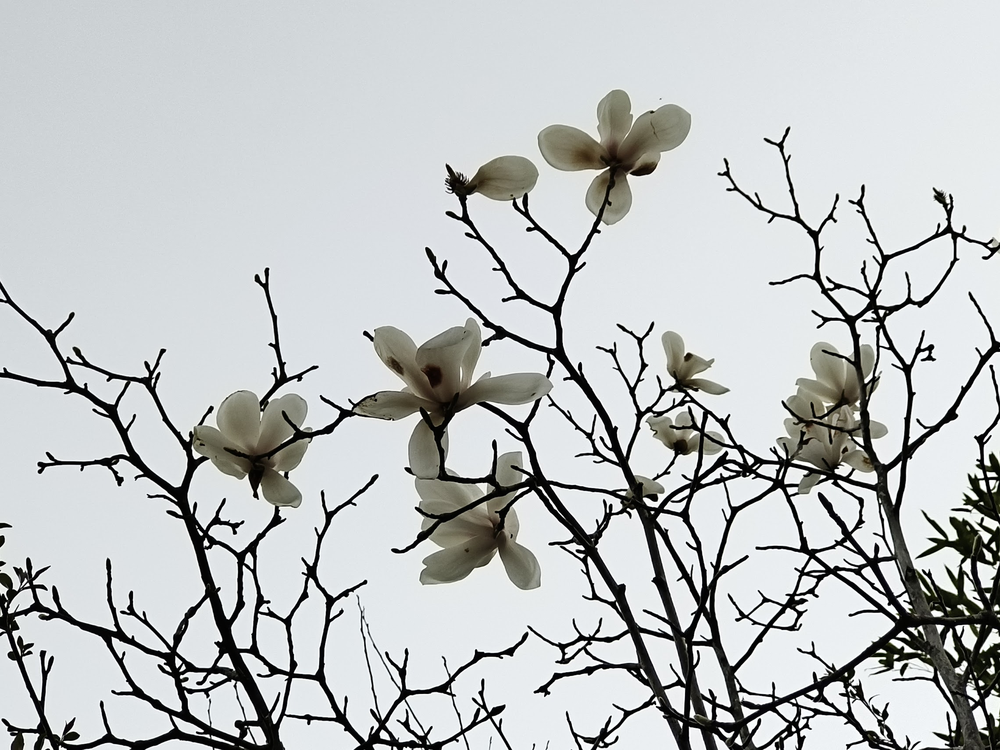

## 摘要

隔壁的电子楼出逝了，我从计科楼里跑路~~顺便看花~~。




<!--more-->
## 梅花

- 存在于图书馆门前和香雪海
- 有明显的甜香气，~~个人感觉有点腻~~
- 因为花期最早，很容易与其他花区分开

花期太早，我返校前已过了盛放期。

### 2024.3.11-12 图书馆附近





## 蜡梅

- 花期早
- 淡黄花
- 明显香气

花期太早，我返校前已过了盛放期。

### 2024.3.12计科楼正门右侧

## 玉兰

- 学校里到处都是
- 大树大花
- 有淡淡的香气
- 样貌与其他花区别较大，容易区分

### 2024.3.12 50

4层楼高的玉兰树

### 2024.3.13 图书馆右侧

 


### 2024.3.20 计科楼





### 2024.3.21 

白玉兰快谢了，紫玉兰快开了，黄玉兰还没开。

上面摄于国际会议中心右侧，中间两张摄于医学院正门右侧，下面摄于1210旁边。





## 樱花

- 学校里较常见且不只一种
- 花梗较长，花瓣尖端有缺刻

### 樱桃 2024.3.13 远东大道2栋和菜根潭之间

- 花期较早
- 花较小，花蕊较长
- 花瓣尖端缺刻明显



 


### 东京樱花

- 花较大
- 开花时不见叶片
#### 2024.3.21 大气山

 



#### 2024.3.21 政管楼门前

### 2024.3.21 大岛樱或山樱 现工院门右侧，只看到一棵

- 花叶同现
- 花较大
- 有淡淡的清香

## 海棠

- 花梗较长
- 花叶同现
- 花不均匀的粉色

### 垂丝海棠

- 学校里到处都是
- 花下垂
- 亮粉色很好看
- 不香

#### 2024.3.21 大气山，还没开全

### 西府海棠

- 花浅粉色

## 紫叶李

- 学校里到处都是
- 花较小，花梗长，花叶同现
- 有奇怪的气味，不好闻

### 2024.3.19


 


## 美人梅

- 据说是宫粉梅和紫叶李的杂交种
- 粉了吧唧的很好看
- 继承了紫叶李的奇怪气味

### 2024.3.20 远东大道图书馆段

 


### 2024.3.21 咏曼阁后身

## 杏花

- 花期很短
- 花梗较短，花白色或很浅的粉色，花萼深红色，反折

学校里我只在图书馆正门右侧见过两棵杏树。

原来是有三棵杏树的，去年砍了一棵，剩下的两棵开的花也是一年不如一年。

我记得前年杏花开花的时候，花密密麻麻的满枝都是，今年只有枝梢上有几朵花。

### 2024.3.12 图书馆正门右侧


 



## 阔瓣含笑

- 和白玉兰，广玉兰同属木兰科
- 乔木，大花，花叶同现
- 有点像广玉兰，但广玉兰夏天开花
- 明显香气

### 2024.3.20 朱共山楼右侧


 



## 山桃

- 白花
- 有点像樱花？但花梗短，花较小

### 2024.3.21 新传院


 


## 诸葛菜

- 草本紫花

### 2024.3.21 敏学路


 


## 金钟花或连翘

- 趴地枝条上的小黄花，但比迎春花开得密，且花下垂似钟

基础实验楼附近的停车场附近也有。

### 2024.3.19 梦川快递站段 

## 月季

- 可能不算春花，因为一直开花

### 2024.3.20 南门到计科楼的路上

